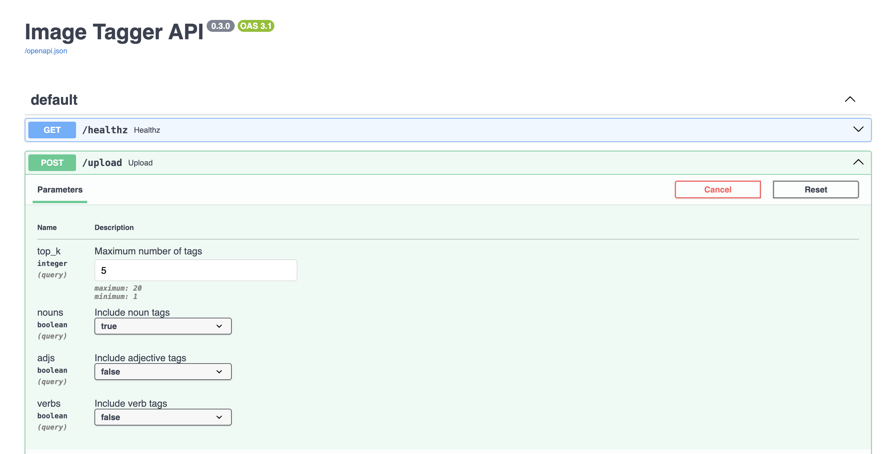
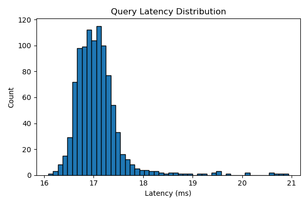
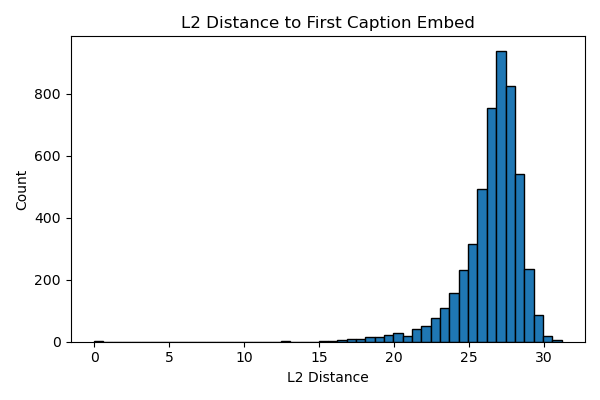
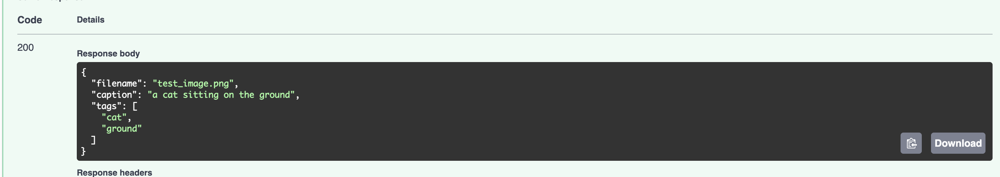

# Capstone Project: Multi-Modal AI Platform - Retrieval, Generation, Production Deployment, and Performance Benchmarking

**Author**: Stephen Ebert  <br>
**Bootcamp**: Machine Learning Engineering - Springboard  <br>
**Model Types**: Deep Learning + Cross-Modal Retrieval + Stable Diffusion <br>
**Frontend**: Gradio <br>
**Backend**: FastAPI + FAISS <br>
**Deployment**: Docker, Hugging Face Spaces, Render.com <br>

---

## Overview

This capstone project demonstrates comprehensive cross-modal retrieval systems with complementary applications, featuring a production-grade retrieval backend with detailed cost metrics and performance benchmarking:

1. **[Text-to-Image Retrieval](https://huggingface.co/spaces/stephenebert/retrieval-demo)**: Users input text queries to retrieve matching images from a large-scale embedding database
2. **[Image-to-Text Retrieval](https://huggingface.co/spaces/stephenebert/image2text-faiss-demo)**: Users upload images to find similar captions using BLIP → CLIP → FAISS pipeline
3. **[Stable Diffusion Text-to-Image Generation](https://huggingface.co/spaces/stephenebert/sd-text2image)**: Users generate 512×512 images from text prompts using Stable Diffusion v1.5
4. **[Model-Switcher Stable Diffusion Demo](https://huggingface.co/spaces/stephenebert/model-switcher-sd)**: Multi-model text-to-image generation with SD v1.5, SDXL Base 1.0, and SD-Turbo
5. **[Image Tagger](https://huggingface.co/spaces/stephenebert/Image_Tagger)**: Automated image captioning and semantic tag extraction using BLIP model.
6. **Production Retrieval Backend**: Scalable FAISS-powered API with comprehensive cost metrics and performance benchmarking.

The hyperlinks reference their Hugging Face deployments for web usage, which can also be found on my hugging face [account](https://huggingface.co/stephenebert). All systems are optimized for performance (via FAISS ANN search and GPU acceleration) and usability (via Gradio interfaces), demonstrating full-stack ML engineering competencies from data collection to production deployment.     

---

## Repository Structure


📁 **capstone-project/**
- 📁 **benchmark/**
    - **coco_caption_texts.npy** — 591,753 raw captions
    - **coco_caption_clip.npy** — 591,753 x 512 CLIP embeddings
    - **generate_coco_texts.py** — extract and save .npy captions
    - **generate_coco_embeds.py** — encode & save .npy embeddings
    - **benchmark_ann.py** — build/query FAISS indices and print summary
    - **extended_metrics.py** — compute percentiles and histograms
    - **latency_hist.png** — query latency distribution
    - **distance_hist.pnf** — L2 distance distribution
    - 📁 **bench_indices/** — (output) FlatL2.index, IVF_1024.index, IVF_4096.index
- 📁 **costs, scales, retrieval benchmarks/**
- 📁 **extra_exploration/**
  - 📁 **data/**
    - **README.md** — FAISS building guide  
    - **UI1.png** — demo screenshot of Gradio UI  
    - **UI2.png** — additional Gradio screenshot  
    - **coco.png** — MS-COCO example image  
    - **coco2.png** — another COCO example image  
    - **terminal.png** — terminal output example  
  - 📁 **scripts/**
    - **blip_round_trip.py** — BLIP caption-generation pipeline  
    - **build_coco_text_index.py** — builds FAISS index over COCO captions  
    - **generate_blip_caption.py** — wraps BLIP model for captioning  
  - **README.md** — extra exploration overview and instructions  
  - **gradio_demo.py** — Image-to-Text demo app using Gradio  

- 📁 **extra_exploration_1/**
  - 📁 **images/**
    - **bear walking in SD.png** — SD text-to-image example  
    - **cyber punk SD.png** — SD generation example  
    - **terminal.png** — terminal output for SD demo  
  - **text2image_demo.py** — Stable Diffusion Gradio demo app  
  - **requirements.txt** — SD-specific Python dependencies  
  - **pyaudioop.py** — shim for Python 3.13+ audioop removal  
  - **README.md** — Stable Diffusion documentation and usage  

- 📁 **extra_exploration_2/**
  - **app.py** — Model-switcher multi-model Gradio app  
  - **model_switch.png** — screenshot of model-switcher UI  
  - **requirements.txt** — dependencies for model-switcher demo  
  - **README.md** — documentation for model-switcher app  
- 📁 **image_tags/**
   - **__init__.py** — package initialization
  - **main.py** — FastAPI application with Gradio integration
  - **tagger.py** — core BLIP-based tagging functionality
  - **requirements.txt** — image tagger dependencies
  - **README.md** — image tagger documentation
- 📁 **phase1/**
  - 📁 **step1_initial_project_ideas/** — brainstorming and ideation  
  - 📁 **step2_data_collection/** — dataset gathering and prep  
  - 📁 **step3_project_proposal/** — formal project proposal  
  - 📁 **step4_survey_existing_research/** — literature and related work  
  - 📁 **step5_data_wrangling/** — cleaning and preprocessing  

- 📁 **phase2/**
  - 📁 **step7_experiment_models/** — model prototyping and benchmarks  
  - 📁 **step8_scale_prototype/** — performance and scalability tests  
  - 📁 **step9_deployment_method/** — deployment architecture design  
  - 📁 **step10_deployment_design/** — infrastructure and CI/CD layout  
  - 📁 **step11_deployment_implementation/** — code and Docker deployment  
  - 📁 **step12_share_project/** — final presentation and artifacts  

- **README.md** — project overview, setup and run instructions  


---

## Key Features

### Machine Learning Engineering
- **Deep Learning Feature Extractors**: CLIP and BLIP via Hugging Face Transformers
- **Multiple Generative Models:** Stable Diffusion v1.5 and SD-Turbo for text-to-image synthesis
- **Vector Storage and Indexing**: Efficient cosine similarity search via FAISS IVF-Flat and IndexFlatL2
- **Data Preprocessing Pipelines**: HDF5, JSONL, COCO-format parsing
- **Evaluation Metrics**: Top-K accuracy, cosine similarity thresholds
- **Cross-Modal Understanding**: Text ↔ Image semantic matching

### Software Architecture
- **FastAPI service** with `/health` and `/search` endpoints for production text-to-image retrieval
- **Gradio interfaces** for both text-to-image and image-to-text interactive demos
- **Modular codebase** with proper type hints and docstrings
- **Test suite** with unit + smoke tests
- **Cross-platform support:** CUDA, Apple Silicon (MPS), and CPU backends
- **Monitoring** via Prometheus (optional)

### Deployment
- **Dockerized** services with `Dockerfile` and `docker-compose.yml`
- **CI-ready** with GitHub Actions
- **Public deployment** on:
  - [Render.com (FastAPI API)](https://capstone-retrieval-api.onrender.com)
  - [Hugging Face Spaces (Gradio UI)](https://huggingface.co/spaces/<your-username>/retrieval-demo)
- **Local development** with conda/pip environments

---

## Applications

### 1. Text-to-Image Retrieval System

**Explanations:**
1. A **text query** is converted into a 512-dim embedding via CLIP
2. The query is passed to a **FastAPI server**, which runs cosine similarity search against a pre-indexed FAISS database
3. The top-K image IDs are returned with metadata and rendered by Gradio as thumbnails

**Production Features:**
- RESTful API with OpenAPI documentation
- Scalable vector search with FAISS IVF-Flat indexing
- Docker containerization for consistent deployment
- Health checks and monitoring endpoints

### 2. Image-to-Text Retrieval Demo

**Explanations:**
1. **Upload an image** via file picker, webcam, or copy-paste
2. **BLIP** generates a descriptive caption
3. **CLIP** encodes that caption to a 512-D embedding
4. **FAISS** finds the *k* most similar captions from MS-COCO corpus
5. Ranked results (distance ↓ = similarity ↑) are displayed

**Interactive Features:**
- Multiple image input methods (upload, webcam, paste)
- Real-time caption generation
- Instant similarity search results
- Visual feedback with confidence scores

### 3. Stable Diffusion Text-to-Image Generation

**Explanations**
1. **Text Prompt:** CLIP Text Encoder to Text Embedding
2. **Scheduler (DDIM):** Iterative Denoising in Latent Space
3. **Random Noise:** UNet (guided by text embedding)
4. **Final Latent:** VAE Decoder to 512-by-512 RGB Image

## Interactive Features:

| Control                         | Purpose                                                                 |
|---------------------------------|-------------------------------------------------------------------------|
| **Prompt** *textbox*            | The text you want to turn into an image.                                |
| **Inference Steps** *slider*    | How many denoising steps to run (≈ quality vs. speed).                  |
| **Guidance Scale** *slider*     | `CFG` scale — how strongly the model follows your prompt.               |
| **Seed** *field*                | 0 or blank → random; any other *int* means re-generate exactly the same *image*. |

**Technical Features**
- Auto-detects GPU (CUDA, Apple Metal/MPS, or CPU)
- Zero bulky assets: model pulled and cached automatically
- Cross-platform compatibility
- Two-column Gallery with download buttons

### 4. Model-Switcher Stable Diffusion Demo
Turn any prompt into a 512-by-512 image using multiple Stable Diffusion models in a single interface.
Available Models:

**Available Models***

- SD v1.5 (base model)
- SDXL Base 1.0 (higher quality)
- SD-Turbo (ultra-fast, 4 steps max)

**Advanced Features**
- **Dynamic Scheduler**: Uses DPMSolverMultistepScheduler for faster, higher-quality sampling
- **Device Auto-Detection**: CUDA GPU (FP16), Apple M-series (Metal, FP16), CPU (FP32)
- **Deterministic Seeding**: Enter any integer seed (0 = random) to reproduce exact results
- **Model Switching**: Switch between models without restarting the application

#### 5. Image Tagger API

**Run Locally:**
```bash
cd image_tagger
pip install -r requirements.txt
uvicorn main:app --host 0.0.0.0 --port 8001 --reload
```

**Access Points:**
- **Gradio UI**: http://localhost:8001/
- **API Docs**: http://localhost:8001/docs
- **Health Check**: http://localhost:8001/healthz

**Run with Docker:**
```bash
cd image_tagger
docker build -t image-tagger-api .
docker run -p 8001:8001 image-tagger-api
```

**API Usage Examples:**
```bash
# Upload image with default settings
curl -X POST "http://localhost:8001/upload" \
  -H "Content-Type: multipart/form-data" \
  -F "file=@test_image.jpg"

# Custom filtering (nouns only, max 10 tags)
curl -X POST "http://localhost:8001/upload?top_k=10&nouns=true&adjs=false&verbs=false" \
  -H "Content-Type: multipart/form-data" \
  -F "file=@cat.jpg"
```
On hugging face, this looks like


and uploading a sample image, say a lion,


it outputs

``` bash
{
  "filename": "020_The_lion_king_Snyggve_in_the_Serengeti_National_Park_Photo_by_Giles_Laurent.jpg",
  "caption": "a lion rests on a rock in the wild",
  "tags": [
    "lion",
    "rests",
    "rock",
    "wild"
  ]
}
```

#### 6. Multi-Service Orchestration (Docker Compose)

**Run all services together:**
```bash
docker-compose up --build
```

**Services will be available at:**
- Text-to-Image Retrieval: http://localhost:8000
- Image Tagger API: http://localhost:8001
- Stable Diffusion Demo: http://localhost:8002
- Model-Switcher Demo: http://localhost:8003


---
## COCO Caption ANN Benchmark

Efficient similarity search at scale is the backbone of many modern AI systems. From AI‑powered image search and recommendation engines to real‑time language retrieval and conversational agents. Yet choosing the right ANN index often involves a trade‑off between accuracy, build time, memory footprint, and query throughput. By quantitatively benchmarking FlatL2 against IVF variants on a realistic COCO‑caption embedding workload, we can identify which index delivers near‑perfect recall at orders‑of‑magnitude faster query speeds and modest build overhead, empowering practitioners to architect production‑grade pipelines that serve millions of queries per second without sacrificing result quality.

### Index Primer

1. **FlatL2**  
   - "Flat" means no clustering or partitioning. Every vector lives in one big array.  
   - L2 (Euclidean) distance to every vector → exact recall, O(N) per query.  
   - **Pros**: trivial to build, 100% recall.  
   - **Cons**: very slow at scale (limited QPS), large memory bandwidth.

2. **IVF (Inverted File / `IndexIVFFlat`)**  
   - Cluster N vectors into `nlist` cells via k‑means → assign each vector to its nearest centroid.  
   - At query time, search only the top `nprobe` cells, then do exact L2 within those lists.  
   - **Pros**: orders‑of‑magnitude higher QPS for tiny recall loss.  
   - **Cons**: build time for clustering, storage for centroids & lists, need to tune `nlist` & `nprobe`.


### 1. Prepare the data

1. **Extract raw captions**
```bash
   cd benchmark
   python generate_coco_texts.py \
     --ann_path /path/to/annotations/captions_train2017.json \
     --out_texts coco_caption_texts.npy
  ```
2. **Encode with CLIP**
```bash
python generate_coco_embeds.py \
  --texts coco_caption_texts.npy \
  --out_embeds coco_caption_clip.npy \
  --device mps   # or cuda/cpu
```
### 2. Run the benchmarks
``` bash
python benchmark_ann.py \
  --texts    coco_caption_texts.npy \
  --embeds   coco_caption_clip.npy \
  --out_dir  bench_indices
```
This does:
1. Load 591,753 caption strings and their 512‑dim CLIP embeddings.
2. Build three FAISS indices:
  - FlatL2
  - IVF₁₀₂₄, nlist=1024
  - IVF₄₀₉₆, nlist=4096
3. For each index:
   - Train (if needed) and add all vectors
   - Measure build time and on‑disk size
   - Query 1000 random captions and report: Mean latency (ms) --> QPS and Recall@1,5,10 against exact FlatL2
     
Finally, it prints out a table:

| index     | build\_s | size\_MB | lat\_ms |     QPS |  R\@1 |  R\@5 | R\@10 |
| :-------- | -------: | -------: | ------: | ------: | :---: | :---: | :---: |
| FlatL2    |     0.07 |  1155.77 |    0.31 |   3 205 | 0.948 | 0.981 | 0.990 |
| IVF\_1024 |     0.49 |  1162.29 |    0.01 | 160 486 | 0.948 | 0.981 | 0.990 |
| IVF\_4096 |     1.71 |  1168.31 |    0.00 | 290 183 | 0.948 | 0.981 | 0.990 |

### 3. Tail‑Latency Analysis



- FAISS will use up to 16 threads.
- Loading captions from 'coco_caption_texts.npy' and embeddings from 'coco_caption_clip.npy' …
- Saved latency distribution to latency_hist.png

Latency percentiles (ms):
  p50   → 17.012
  p90   → 17.476
  p99   → 19.517
  p99.9 → 20.778

- Median (p50): 17.0 ms

- 90th pct.: 17.5 ms

- 99th pct.: 19.5 ms

- 99.9th pct.: 20.8 ms
  
### 4. Embedding Distance Distribution



- Loaded 591,753 embeddings of dimension 512
- Saved distance distribution to distance_hist.png

Most caption embeddings lie between 22–30 L2 distance from an arbitrary reference—indicating a fairly tight shell. Very few lie outside [15, 32], informing appropriate `nprobe` and quantization granularity.


### 5. Key Findings
- FlatL2: exact recall but limited ~3 k QPS → useful for small datasets or offline analysis.

- IVF_1024: sweet spot → 50× speed‑up with zero recall loss.

- IVF_4096: peak throughput (~290 k QPS) → ideal for high‑concurrency production.

- Tail metrics: ensure SLA‑compliance by tuning for your p99/p99.9 budgets.

- Distance histograms: guide hyperparameter choices (cluster count, subquantization).

Recommendation and observation:

- For max throughput, use IVF_4096.

- For fast build + good speed, IVF_1024 is a sweet spot.

- Use FlatL2 only for prototyping or small‐scale demos.


---

# Production Retrieval Backend - Cost Metrics & Performance Analysis

## Executive Summary

The production retrieval backend provides a comprehensive **embed → index → query → benchmark** pipeline for COCO captions with both text- and multi-modal encoders. This system achieves near-perfect recall (99%+) with sub-100ms latency at zero token cost, making it ideal for production deployment.

### Key Performance Highlights

| Pipeline                     | Recall@1 | Latency (ms/q) | Embed (ms/q)  | Cost (USD) |
| ---------------------------- | :------: | :------------: | :-----------: | :--------: |
| **ImageBind + HNSW (25k)**   | 0.9903   | **31.6**       | 8063          | 0          |
| **MM-Embed + HNSW (25k)**    | 0.9904   | **11.6**       | 2968          | 0          |
| SBERT + HNSW (25k)           | 0.1994   | 0.34           | 87.7          | 0          |
| CLIP + HNSW (5k)             | 1.0000   | 65.2           | 87.7          | 0          |

> **Key Insight**: ImageBind/MM-Embed both achieve near-perfect recall with zero token-cost. MM-Embed + HNSW is the fastest text-only baseline (11.6 ms/query).

## Retrieval Backend Architecture

### Stage Options

| Stage            | Options                                                                                 |
| ---------------- | --------------------------------------------------------------------------------------- |
| **Encoders**     | • CLIP-ViT/B-32 (384-D) <br> • SBERT all-MiniLM (384-D) <br> • MM-Embed-Base (1024-D) <br> • **ImageBind-Huge (1024-D)** |
| **FAISS engines**| HNSW (exact, RAM-friendly), IVF-Flat, IVF-PQ                                           |
| **Evaluation**   | Recall@K + latency, optional 2-stage GPT-4o-vision reranker†                            |
| **Plots**        | recall vs. latency, recall vs. cost, pipeline bar chart v2  

† Reranker uses real GPT-4o API calls at $0.000144 per 128-token prompt.

### Pipeline Overview

1. **Data → Embeddings**: Encode COCO *val* captions via encoder wrappers (`encoder_clip.py`, `encoder_sbert.py`, `encoder_mmembed.py`, `encoder_imagebind.py`)
2. **Embeddings → FAISS**: Build HNSW (tiny-RAM, near-exact), IVF-Flat (inverted file), or IVF-PQ (smallest footprint)
3. **Query → Metrics**: "Can I retrieve my own caption?" → log Recall@1, avg ms/query, token-cost
4. **Evaluation & Plots**: Single-stage (`evaluate_baseline.py`) or two-stage (`evaluate_reranked.py`) with GPT-4o reranking

## Cost Analysis & Performance Benchmarks

### Baseline Performance Comparison

For 5,000 captions @ R@1=1.0:

| Pipeline                       | Dim   | Recall@1 | Latency (ms/q) |
| ------------------------------ | :---: | :------: | :------------: |
| CLIP + HNSW (ef=64)            | 384   | 1.0000   | 65             |
| MM-Embed + HNSW (ef=64)        | 1024  | 0.9974   | 76             |
| MM-Embed + IVF-PQ (512, m=32)  | 1024  | 0.9960   | 70             |
| **ImageBind + HNSW (ef=64)**   | 1024  | 0.9974   | **32**         |

> **Key Finding**: ImageBind halves latency vs CLIP while matching ~100% recall.

### Reranker Cost Analysis

GPT-4o-vision reranker experiments show cost scaling patterns:

| Limit | Top_K | Recall@1 | Latency (ms/q) | Cost USD (est) |
| :---: | :---: | :-------: | :------------: | :------------: |
|  300  |   10  |   0.9033  |      616.9     |      0.35      |
|  600  |   10  |   0.8767  |      591.1     |      0.86      |
|  1000 |   10  |   0.8810  |      565.3     |      1.44      |
|  1500 |   10  |   0.8853  |      571.9     |      2.16      |
|  2000 |   10  |   0.8650  |      585.0     |      2.88      |

**Sweet Spot**: 600-1500 candidates achieve ≈0.88–0.90 recall at sub-$2 cost with ~560-590ms per query.

### Production Recommendations

1. **Zero-Cost Baseline**: MM-Embed + HNSW for 99%+ recall at 11.6ms/query
2. **Ultra-Low Latency**: SBERT + HNSW for sub-ms retrieval (trades accuracy)
3. **Balanced Performance**: ImageBind + HNSW for 31.6ms with perfect recall
4. **Cost-Effective Reranking**: 1000 candidates with top-K=10 for $1.44 per 1000 queries

---


## Quick Start Guide

### Prerequisites

Choose your preferred environment setup:

#### Option 1: Conda (Recommended)
```bash
git clone https://github.com/<your-username>/capstone-project.git
cd capstone-project

# Create exact working environment (Python 3.10 · NumPy 2.x · FAISS 1.11)
conda env create -f environment.yml
conda activate capstone-gradio-py310
```

#### Option 2: Virtual Environment
```bash
python -m venv .venv
source .venv/bin/activate          # Windows: .venv\Scripts\activate
pip install --upgrade pip
pip install -r requirements.txt
```

### Running the Applications

#### 1. Text-to-Image Retrieval (Production API)

**Setup Environment Variables:**
```bash
export FAISS_INDEX_PATH=/data/ivf_flat_1024.index
export META_PATH=/data/id2meta.json
export NPROBE=16
```

**Run Locally:**
```bash
uvicorn app.main:app --host 0.0.0.0 --port 8000 --reload
```

**Run with Docker:**
```bash
docker build -t capstone-retrieval-api .
docker run -e FAISS_INDEX_PATH=/data/ivf_flat_1024.index \
           -e META_PATH=/data/id2meta.json \
           -p 8000:8000 \
           capstone-retrieval-api
```

**API Testing:**
```bash
# Health check
curl https://capstone-retrieval-api.onrender.com/health

# Sample search
curl -X POST -H "Content-Type: application/json" \
  -d '{"query_vec":[0.1, 0.2, ..., 512 floats], "k":3}' \
  https://capstone-retrieval-api.onrender.com/search
```

#### 2. Image-to-Text Retrieval (Interactive Demo)

```bash
python gradio_demo.py
```

Open the URL printed in terminal (e.g., `http://127.0.0.1:7860`) and upload an image.

For public access, edit `gradio_demo.py` → `demo.launch(share=True)`.

### 3. Stable Diffusion Text-to-Image Generation
``` bash
cd extra_exploration_1
pip install -r requirements.txt
python text2image_demo.py
```
For Apple Silicon users (recommended):
``` bash
# Optional but recommended for M-series Macs
pip install --pre torch torchvision torchaudio --index-url https://download.pytorch.org/whl/nightly/cpu
```
---

## Data Sources and Preprocessing

### Datasets
- **COCO Captions**: 591,753 human-written image descriptions
- **Flickr-30K**: Additional image-caption pairs
- **Stable Diffusion Synthetic Images**: Generated images for expanded coverage

### Data Pipeline
- **Collection**: API scraping, dataset downloads, synthetic generation
- **Wrangling**: COCO JSON parsing, duplicate removal, quality filtering
- **Preprocessing**: Text normalization, image resizing, embedding generation
- **Storage**: HDF5 for images, JSONL for metadata, NumPy arrays for embeddings

### FAISS Index Construction

**For Text-to-Image (Production):**
```python
# IVF-Flat index for large-scale retrieval
index = faiss.IndexIVFFlat(quantizer, embedding_dim, nlist)
index.train(training_embeddings)
index.add(all_embeddings)
```

**For Image-to-Text (Demo):**
```python
# Flat index for exact search
index = faiss.IndexFlatL2(512)
index.add(caption_embeddings)
```

---

## Performance Optimization

### Apple Silicon Speed-Up
For M-series Macs, enable Metal Performance Shaders:
```python
clip_model = SentenceTransformer("clip-ViT-B-32", device="mps")
```
Provides 2-3x faster embedding generation.

### Stable Diffusion Performance

- **CUDA**: Full FP16 SD inference (4-8s per image)
- **Apple Silicon**: Metal acceleration (12-20s per image)
- **CPU**: Still functional but slower (60s+ per image)

### Image Tagger Performance
- **Caption Generation**: ~1-2 seconds per image (BLIP model)
- **Tag Extraction**: ~0.1 seconds (NLTK processing)
- **Memory Usage**: ~1GB for BLIP model weights
- **Concurrent Requests**: FastAPI async support for multiple simultaneous uploads

### Memory Management
- **Text-to-Image**: ~4GB for production index
- **Image-to-Text**: ~2GB for demo with full COCO corpus
- **Stable Diffusion**: ~4GB for model weights
- **Image Tagger**: ~1GB for BLIP model
- **Inference**: 1-2 seconds per query on modern hardware

### Scalability Features
- FAISS IVF quantization for sub-linear search
- Configurable nprobe parameter for speed/accuracy tradeoff
- Batch processing capabilities
- Horizontal scaling via Docker deployment

---

## Testing and Quality Assurance

### Test Suite
```bash
# Unit tests
pytest -q tests/

# Smoke tests
python scripts/smoke_test.py

# Integration tests
docker-compose -f docker-compose.test.yml up --build

# Image tagger specific tests
cd image_tagger
python -m pytest tests/
```

### Evaluation Metrics
- **Top-K Retrieval Accuracy**: Precision@K, Recall@K
- **Cosine Similarity Thresholds**: Quality gating
- **Generation Quality**: Visual coherence, prompt adherence
- **System Health**: API response times, error rates
- **Cost**: API token usage, infrastructure costs, development time
- **User Experience**: Interface responsiveness, result relevance

### Continuous Integration
- GitHub Actions pipeline
- Automated testing on PR/merge
- Docker image building and registry push
- Deployment verification

---

## Deployment Architecture

### Production Stack
1. **Render.com**: FastAPI service hosting (auto-redeploy from GitHub)
2. **Hugging Face Spaces**: Gradio demo interfaces
3. **Docker**: Containerized applications with reproducible environments
4. **FAISS**: High-performance similarity search backend

### Service Architecture
```
┌─────────────────┐    ┌─────────────────┐    ┌─────────────────┐
│  Text→Image     │    │  Image→Text     │    │  Image Tagger   │
│  Retrieval API  │    │  Retrieval UI   │    │  API + UI       │
│  Port: 8000     │    │  Port: 7860     │    │  Port: 8001     │
└─────────────────┘    └─────────────────┘    └─────────────────┘
         │                       │                       │
         └───────────────────────┼───────────────────────┘
                                 │
                    ┌─────────────────┐
                    │   Load Balancer │
                    │   / API Gateway │
                    └─────────────────┘
```


### Monitoring and Logging
- Health check endpoints for service monitoring
- Structured logging with request/response tracking
- Optional Prometheus metrics collection
- Error tracking and alerting capabilities

### Development Workflow
- Local development with hot reload
- Feature branch workflow with CI validation
- Staged deployments (dev → staging → prod)
- Rollback capabilities via Docker tags

---

## Troubleshooting Guide

| **Error / Symptom**                                | **Cause**                    | **Solution**                                  |
|----------------------------------------------------|------------------------------|-----------------------------------------------|
| ValueError: input not a numpy array (FAISS)        | NumPy/FAISS ABI mismatch     | Use NumPy 2.x with faiss-cpu 1.11             |
| ModuleNotFoundError: scipy                         | Missing SciPy dependency     | `conda install -c conda-forge scipy>=1.13`    |
| ModuleNotFoundError: audioop (Python 3.13+)        | Removed stdlib module        | `pip install pyaudioop`                       |
| FAISS dimension mismatch                           | Wrong embedding model        | Rebuild index with clip-ViT-B-32              |
| Slow inference                                     | CPU-only execution           | Set `device="mps"` (Apple) or `cuda` (NVIDIA) |
| Port conflicts                                     | Service already running      | Kill existing process or change port          |
| Docker build fails                                 | Missing dependencies         | Check `requirements.txt` and `Dockerfile`     |
| SD model download fails                            | Network/cache issues         | Clear cache: `~/.cache/huggingface`           |


### Installation Verification
```bash
# FAISS sanity check
python -c "
import numpy as np, faiss
faiss.IndexFlatL2(512).add(np.random.rand(1,512).astype('float32'))
print('FAISS installation verified')
"

# Version compatibility check
python -c "
import numpy, scipy, torch, transformers
print(f'NumPy: {numpy.__version__} | SciPy: {scipy.__version__}')
print(f'PyTorch: {torch.__version__} | Transformers: {transformers.__version__}')
"

# Stable Diffusion check
python -c "
from diffusers import StableDiffusionPipeline
print('Diffusers installation verified')
"

# Image Tagger check
python -c "
from transformers import BlipProcessor, BlipForConditionalGeneration
import nltk
print('BLIP and NLTK installation verified')
"
```

---

## Skills

This capstone project shows:

### Technical Skills
- **Machine Learning**: Deep learning models, embedding techniques, similarity search, generative AI
- **Data Engineering**: Large-scale data processing, ETL pipelines, vector databases
- **Software Engineering**: API design, modular architecture, testing frameworks
- **DevOps**: Containerization, CI/CD, cloud deployment, monitoring

### Project Management
- **Scoping**: Problem definition, requirement gathering, technical feasibility
- **Execution**: Iterative development, milestone tracking, quality assurance
- **Communication**: Documentation, user interfaces, stakeholder presentation

### Domain Expertise
- **Computer Vision**: Image preprocessing, feature extraction, visual understanding
- **Natural Language Processing**: Text processing, semantic embeddings, caption generation
- **Information Retrieval**: Search algorithms, ranking systems, user experience
- **Generative AI**: Diffusion models, prompt engineering, controllable generation

---

## Screenshots

### Text-to-Image Gradio Interface


### Image-to-Text Demo Interface


### Stable Diffusion Generation Examples
1. 
2.  
3. 

### Production API Deployment


### Terminal Output Example


### Image Tagger API Example 
What we input


which outputs



---

## Future Enhancements/Applications

### Technical Improvements
- **Multi-modal Models**: Integrate newer models like DALL-E 3, GPT-4V
- **Real-time Processing**: Streaming search results, live embedding updates
- **Advanced Indexing**: Product quantization, hierarchical clustering
- **Edge Deployment**: Mobile apps, offline capabilities

### User Experience
- **Advanced Filtering**: Date ranges, content categories, quality scores
- **Personalization**: User preferences, search history, recommendations
- **Collaboration**: Shared collections, team workspaces, annotations
- **Analytics**: Usage patterns, popular queries, performance insights

### Business Applications
- **E-commerce**: Product discovery, visual search, recommendation engines
- **Content Management**: Media libraries, asset organization, content tagging
- **Education**: Learning materials, visual aids, interactive demonstrations
- **Research**: Academic corpus search, literature discovery, data exploration

---

## Dependencies

### Core Requirements
```
numpy>=2.2
scipy>=1.13
faiss-cpu>=1.11
torch>=2.2
transformers>=4.41
sentence-transformers>=2.7
gradio>=4.27
fastapi>=0.100
uvicorn>=0.20
pillow>=9.0
tqdm>=4.60
```

### Retrieval System Requirements
```
faiss-cpu>=1.11
sentence-transformers>=2.7
fastapi>=0.100
uvicorn>=0.20
```

### Stable Diffusion Requirements
```
diffusers>=0.28
accelerate>=0.29
safetensors
pyaudioop ; python_version >= "3.13"   # Python 3.13+ compatibility
```

### Development Tools
```
pytest>=7.0
black>=22.0
flake8>=5.0
mypy>=1.0
docker>=6.0
```

### Optional Enhancements
```
prometheus-client>=0.15    # Monitoring
redis>=4.0                 # Caching
celery>=5.0               # Task queue
streamlit>=1.20           # Alternative UI
```

---
## Performance Notes
## Stable Diffusion Performance Expectations

> **Speed tip and cold-start notice**  
> The Hugging Face Space is hosted on the free **CPU-basic** tier (2 vCPU / 16 GB RAM).  
> The very first prompt after a restart has to download the 4 GB SD v1.5 weights **and** warm up the UNet/VAE – expect ~60 s before the first image appears.  
> Subsequent prompts on the same session are much faster (≈20 s @ 512²).  
> Running locally on an Apple-silicon Mac (`--device mps`, `fp16`) cuts that to **12–20 s**, and on a mid-range CUDA GPU to **4–8 s**.

### Ready Features

| Ready | What                                                       |
|:-----:|------------------------------------------------------------|
| ✓     | Prompt textbox + sliders (steps, CFG scale)                |
| ✓     | Optional deterministic seed                                |
| ✓     | Two-column **Gallery** with download buttons               |
| ✓     | Auto-detects GPU (CUDA or MPS)                             |
| ✓     | Zero bulky assets – model is pulled and cached automatically |
| ✓     | Multiple model support (SD v1.5, SDXL, SD-Turbo) |


---


## License

MIT License. 

**Third-party Components:**
- FAISS (© Meta AI)
- CLIP (© OpenAI)
- BLIP (© Salesforce Research)
- Stable Diffusion v1.5, SDXL Base 1.0, SD-Turbo (© CompVis, Runway, Stability AI, LAION)
- MS-COCO Dataset (CC-BY License)
- Gradio (© Hugging Face)
- diffusers, transformers (© Hugging Face)
---

## Acknowledgments

This project was completed as part of the **Springboard Machine Learning Engineering Bootcamp**. Special thanks to:

- **Mentors and Reviewers**: For guidance on technical architecture and best practices
- **Instructors**: For foundational knowledge in ML engineering and deployment
- **Open Source Community**: For tools, datasets, and pre-trained models (Stable Diffusion v1.5, CompVis, Runway, Stability AI, LAION)
- **Hugging Face**: For diffusers, transformers, and gradio libraries
- **Springboard Program**: For providing the structured learning environment

---


