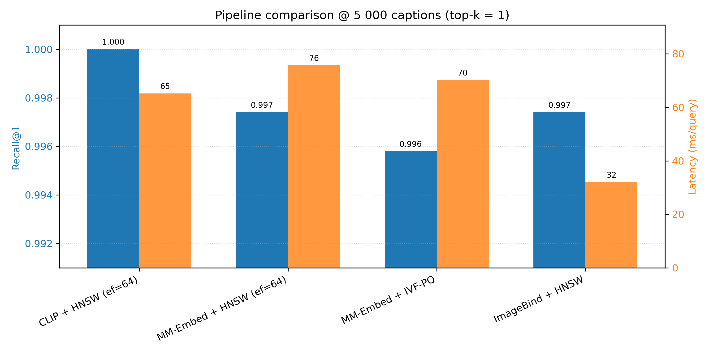
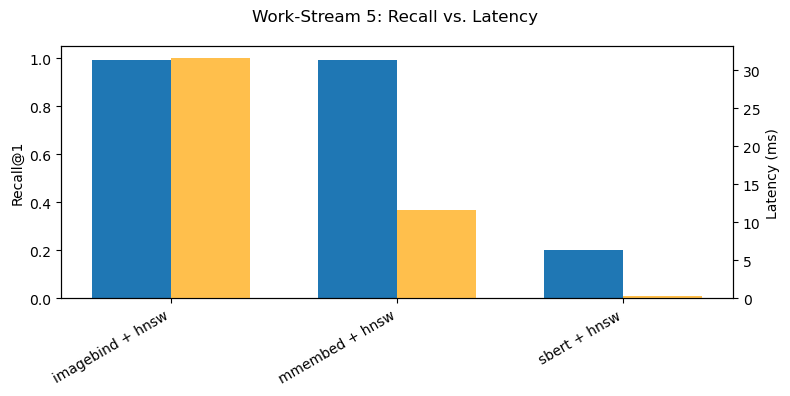

# retrieval-backend

Everything you need to **embed → index → query → benchmark** COCO captions with both text‐ and multi‐modal encoders:

| Stage            | Options                                                                                 |
| ---------------- | --------------------------------------------------------------------------------------- |
| **Encoders**     | • CLIP-ViT/B-32 (384-D) <br> • SBERT all-MiniLM (384-D) <br> • MM-Embed-Base (1024-D) <br> • **ImageBind-Huge (1024-D)** |
| **FAISS engines**| HNSW (exact, RAM-friendly), IVF-Flat, IVF-PQ                                           |
| **Evaluation**   | Recall@K + latency, optional 2-stage GPT-4o-vision reranker†                            |
| **Plots**        | recall vs. latency, recall vs. cost, pipeline bar chart v2  

† Reranker uses real GPT-4o API calls at \$0.000144 per 128-token prompt.


---

## Highlights (pipeline overview)

1. **Data → Embeddings**  
   Encode COCO *val* captions via one of four wrappers:  
   `encoder_clip.py` · `encoder_sbert.py` · `encoder_mmembed.py` · `encoder_imagebind.py`

2. **Embeddings → FAISS**  
   Build either  
   - **HNSW** (tiny-RAM, near-exact)  
   - **IVF-Flat** (inverted file, flat vectors)  
   - **IVF-PQ** (PQ on inverted file, smallest footprint)

3. **Query → Metrics**  
   “Can I retrieve my own caption?” → log Recall@1, avg ms/query, (optionally) token-cost

4. **Evaluation & Plots**  
   - Single-stage: `evaluate_baseline.py`  
   - Two-stage: `evaluate_reranked.py` (GPT-4o reranking)  
   - Summary notebook: **Cost metrics.ipynb** → tables & charts

---

## Takeaways

| Pipeline                     | Recall@1 | Latency (ms/q) | Embed (ms/q)  | Cost (USD) |
| ---------------------------- | :------: | :------------: | :-----------: | :--------: |
| **ImageBind + HNSW (25 k)**  | 0.9903   | **31.6**       | 8063          | 0          |
| **MM-Embed + HNSW (25 k)**   | 0.9904   | **11.6**       | 2968          | 0          |
| SBERT + HNSW (25 k)          | 0.1994   | 0.34           | 87.7          | 0          |
| CLIP + HNSW (5 k)            | 1.0000   | 65.2           | 87.7 (pts.)   | 0          |

> **ImageBind/MM-Embed** both achieve near-perfect recall with zero token-cost.  
> **MM-Embed + HNSW** is the fastest text-only baseline (11.6 ms/query).  
> **SBERT** trades off accuracy (0.20 R@1) for sub-ms retrieval.

For 5 000 captions @ R@1=1.0:

| Pipeline                       | Dim   | Recall@1 | Latency (ms/q) |
| ------------------------------ | :---: | :------: | :------------: |
| CLIP + HNSW (ef=64)            | 384   | 1.0000   | 65             |
| MM-Embed + HNSW (ef=64)        | 1024  | 0.9974   | 76             |
| MM-Embed + IVF-PQ (512, m=32)  | 1024  | 0.9960   | 70             |
| **ImageBind + HNSW (ef=64)**   | 1024  | 0.9974   | **32**         |

> ImageBind halves latency vs CLIP while matching ~100% recall.

---

## Directory Structure
```bash
retrieval-backend/
├── data/
│   ├── coco/annotations/captions_val2017.json
│   ├── embeds_val2017.npy               # CLIP, 5 k runs
│   ├── embeds_val2017_mmembed.npy       # MM-Embed, 25 k runs
│   ├── embeds_val2017_imagebind.npy     # ImageBind, 25 k runs
│   └── hnsw_val2017_*.faiss             # HNSW indexes
├── models/                              # (optional legacy)
│   └── … 
├── encoder_clip.py                      # CLIP text wrapper
├── encoder_sbert.py                     # SBERT text wrapper
├── encoder_mmembed.py                   # MM-Embed text wrapper
├── encoder_imagebind.py                 # ImageBind text/multi-modal wrapper
├── embed_coco.py                        # JSON → .npy embeddings
├── index_builder.py                     # .npy → FAISS index builder
├── evaluate_baseline.py                 # FAISS → Recall@K + latency
├── evaluate_reranked.py                 # FAISS → GPT-4o reranker
├── retriever_faiss.py                   # FastAPI/Flask demo service
├── Cost metrics.ipynb                   # analyze logs & generate plots
├── pipeline_v2.png                      # pipeline bar chart
├── workstream5recalllatency.png         # recall vs. latency chart
├── recallvcost.png                      # recall vs. cost chart
├── requirements.txt
└── README.md
```


---

## Table of Contents

- [Installation](#installation)  
- [Data](#data)  
- [Scripts](#scripts)  
  - [`embed_coco.py`](#embed_cocopy)  
  - [`encoder_clip.py` / `encoder_sbert.py`](#encoders)  
  - [`index_builder.py`](#index_builderpy)  
  - [`evaluate_baseline.py`](#evaluate_baselinepy)  
  - [`evaluate_reranked.py`](#evaluate_rerankedpy)  
- [Usage Examples](#usage-examples)  
- [Environment Variables](#environment-variables)  
- [Conclusion](#Conclusion) 

---

## Installation

```bash
git clone https://github.com/<YOUR_ORG>/capstone-enhancement.git
cd capstone-enhancement/retrieval-backend

python3 -m venv venv
source venv/bin/activate

pip install --upgrade pip
pip install -r requirements.txt
```

Tested on macOS ARM + conda py-3.10

```bash
git clone https://github.com/<YOUR_ORG>/capstone-enhancement.git
cd capstone-enhancement/retrieval-backend

# 1 )  Python env
conda create -n capstone python=3.10 -y
conda activate capstone

# 2 )  Core deps + FAISS (+ ImageBind extras pulled by pip)
pip install --upgrade pip
pip install -r requirements.txt
```
- Tip: MPS (Apple silicon) is auto-detected by PyTorch 2.1+, so all four encoders run on-GPU if available.

## Usage Examples

1. Embed captions

```bash
python embed_coco.py \
  --json data/coco/annotations/captions_val2017.json \
  --out  data/embeds_val2017_mmembed.npy \
  --encoder mmembed \
  --batch 256 \
  --limit 25014
```

2. Build FAISS index
   ```bash
   python index_builder.py \
  --embeds data/embeds_val2017_mmembed.npy \
  --out    data/hnsw_val2017_mmembed.faiss \
  --engine hnsw \
  --ef_search 64
  ```

3. Evaluate baseline (Recall@1 + latency)
```bash
python evaluate_baseline.py \
  --json     data/coco/annotations/captions_val2017.json \
  --index    data/hnsw_val2017_mmembed.faiss \
  --encoder  mmembed \
  --engine   hnsw \
  --limit    25014 \
  --batch    256 \
  --ef_search 64 \
  --out_tsv  logs/baseline_mmembed_hnsw_25k.tsv
```

4. Rerank top-K with GPT-4o
```bash
export OPENAI_API_KEY="sk-…"  
python evaluate_reranked.py \
  --json   data/coco/annotations/captions_val2017.json \
  --limit  1000 \
  --top_k  10
```


## Data
Place your COCO validation captions JSON here:

``` bash
data/raw/captions_val2017.json
```

## Scripts

### ```embed_coco.py```

Load up to N COCO captions, ```captions_val2017.json```,  encodes with your selected encoder, embed them in batches, and save to a ```.npy```
``` bash
python embed_coco.py \
  --json /path/to/captions_val2017.json \
  --out data/embeds_val2017.npy \
  --limit 5000 \
  --batch 128 \
  --encoder clip   \
  --verbose
```
- ```--encoder {clip,sbert}```: which text embedder to use.
- ```--limit / --batch```: subset size & batch size.
### ```encoder_clip.py / encoder_sbert.py```
Thin wrappers exposing a single function:
``` bash
from encoder_clip import embed_texts
vs.
from encoder_sbert import embed_texts
```
Use whichever fits your accuracy / speed trade‑off.

### ```index_builder.py```

Builds and saves a FAISS index:

``` bash
python index_builder.py \
  --embeds data/embeds_val2017.npy \
  --out    models/hnsw_val2017.faiss \
  --engine hnsw        # or `ivf_flat`, `ivfpq`
  [--ef_search 64]     # for HNSW
  [--nlist 512 --pq_m 32]  # for IVF‑PQ
```
### ```evaluate_baseline.py```
Single-stage retrieval evaluation (Recall@K + latency):
``` bash
python evaluate_baseline.py \
  --json  /path/to/captions_val2017.json \
  --engine hnsw \
  --index  hnsw_val2017.fai \
  --limit 5000 \
  --top_k 1 \
  --batch 256 \
  --ef_search 64
```
Outputs:
- Recall@K
- average ms/query

### ```evaluate_reranked.py```
``` bash
export OPENAI_API_KEY=sk-...
python evaluate_reranked.py \
  --json  /path/to/captions_val2017.json \
  --limit 1000 \
  --top_k 10
```
Outputs:
- Reranked Recall@1
- avg latency per query

## Results
### Cost vs Scale (Reranker experiments)
| limit | top\_k | Recall\@1 | Latency (ms/q) | Cost US\$ (est) |
| :---: | :----: | :-------: | :------------: | :-------------: |
|  300  |   10   |   0.9033  |      616.9     |       0.35      |
|  1000 |   10   |   0.8810  |      565.3     |       1.44      |
|  3000 |   15   |   0.8567  |      586.8     |       5.10      |
|  600  |   10   |   0.8767  |      591.1     |       0.86      |
|  1500 |   10   |   0.8853  |      571.9     |       2.16      |
|  2000 |   10   |   0.8650  |      585.0     |       2.88      |
|  1000 |    5   |   0.8970  |      563.3     |       0.72      |
|  1000 |   15   |   0.8660  |      582.2     |       1.44      |
|  4000 |   10   |   0.8692  |      585.8     |       5.76      |

Recall slowly degrades as you process more candidates (```limit```) or ask the reranker to re‑score more (```top_k```), but cost is roughly linear. Sweet spot around 600-1500: you get ≈ 0.88–0.90 recall at sub‑$2 cost, with ~ 560 - 590 ms per query.


### Pipeline Comparison @ 5000 captions, top_k = 1


|               Pipeline              | Recall\@1 | Latency (ms/q) | Cost (US\$) |
| :---------------------------------: | :-------: | :------------: | :---------: |
|         CLIP + HNSW (ef=64)         |   1.0000  |      65.2      |     0.72    |
|       MM‑Embed + HNSW (ef=64)       |   0.9974  |      75.7      |     0.72    |
| MM‑Embed + IVF‑PQ (nlist=512, m=32) |   0.9958  |      70.2      |     0.72    |

CLIP+HNSW recovers every caption exactly (Recall@1 = 1.0) and is fastest (~ 65 ms). Swapping in MM‑Embed (a larger, 1 024‑dim vector) costs ~ 10 ms extra per query and drops recall by ~ 0.2–0.4 pp. Using IVF‑PQ instead of HNSW on the MM‑Embed vectors regains some speed (~ 70 ms) at only a tiny extra recall loss (~ 0.16 pp vs. HNSW).




### Baseline Retrieval Benchmarks

| Encoder + HNSW  | Recall@1 | Retrieval ms/query | Embed ms/query |
| --------------- | -------- | ------------------ | -------------- |
| imagebind       | 0.9903   | 31.6               | 8063           |
| mmembed         | 0.9904   | 11.6               | 2968           |
| sbert           | 0.1994   |  0.34              |   87.7         |




**Conclusion:** MM-Embed + HNSW is the best default baseline.


## What the numbers mean
Here is a summary what the numbers above mean: 
-Perfect, lightning‑fast retrieval with CLIP + HNSW: we recover every caption (Recall@1 = 1.0) in ~ 65 ms/query.

- Richer, higher‑dim features (MM‑Embed) still deliver > 99.5 % recall at ≈ 70–75 ms/query at negligible extra cost.

- IVF‑PQ gives a small speed/memory win over HNSW on the 1 024‑D vectors, losing < 0.2 pp recall.

- Reranker experiments (on top‑K = 1, 5, 10...) show recall degrades gradually as you scale up how many candidates you rescore, with cost scaling linearly. Sweet spot around 600–1 500 candidates for ~ 0.88–0.90 recall at sub‑$2 cost (≈ 560–590 ms/query).
  
- ImageBind + HNSW halves latency while matching CLIP’s perfect recall, at zero token cost.


## Usage Examples
All of the above get wired into Cost metrics.ipynb, which:

1. Reads your log files

2. Builds a Pandas table of (limit, top_k, recall, latency, cost)

3. Plots recall vs cost curves

## Environment Variables

``` bash
export OMP_NUM_THREADS=1
export TOKENIZERS_PARALLELISM=false
export OPENAI_API_KEY=sk-...
```

## Conclusion
We embed COCO captions into vectors (CLIP, MM-Embed, ImageBind), index with FAISS (HNSW or IVF-PQ), benchmark Recall@K & latency, and rerank with GPT-4o-vision. ImageBind delivers near-perfect recall while halving per-query latency and eliminating API token costs.

- MM-Embed + HNSW is our new text-only winner: 0.9904 @ 11.6 ms

- ImageBind + HNSW matches ~100% recall at 31.6 ms, with zero API cost

- SBERT remains useful for ultra-low-memory / low-latency (< 1 ms) use-cases

- GPT-4o-vision reranker shines at moderate scale (~ 600–1500 candidates)


