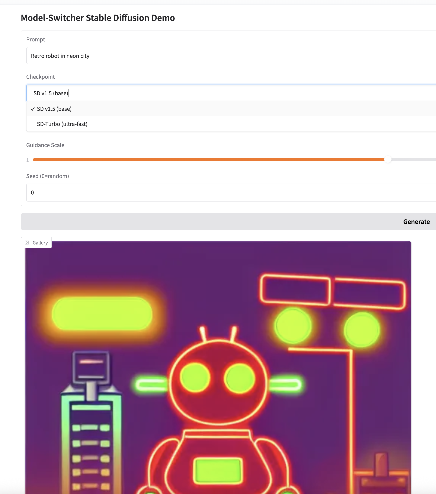

# Model-Switcher Stable Diffusion Demo



Turn any prompt into a 512×512 image using **Stable Diffusion v1.5**, **SDXL Base 1.0**, or the ultra-fast **SD-Turbo** — all wrapped in a single, clean **Gradio** interface.

---

## Repository Structure
``` bash
extra_exploration_2/
├─ app.py # Gradio app with model‐switcher logic
├─ model_switch.png # Screenshot of UI
├─ requirements.txt # Python dependencies
└─ README.md 
```
## Features

- **Multiple Checkpoints**  
  - SD v1.5 (base)  
  - SDXL Base 1.0  
  - SD-Turbo (ultra-fast, 4 steps max)

- **Auto-Detects Device**  
  - CUDA GPU (FP16)  
  - Apple M-series (Metal, FP16)  
  - CPU (FP32)

- **Dynamic Scheduler**  
  Uses `DPMSolverMultistepScheduler` for faster, higher-quality sampling.

- **Deterministic Seeding**  
  Enter any integer seed (0 = random) to reproduce exact results.

- **Simple, One-File App**  
  All logic lives in `app.py`, with pip-installable dependencies in `requirements.txt`.

---

## Quick Start

1. **Clone this repo**  
   ``` bash
   git clone https://github.com/stephenebert/Springboard.git
   cd Springboard/capstone-project/extra_exploration_2
    ```

2. **Install dependencies**
  ``` bash
python -m venv .venv && source .venv/bin/activate
pip install -r requirements.txt
```

3. **Run locally**
``` bash
python app.py
# http://127.0.0.1:7860/
```
4. **Play!**

- Type your prompt

- Pick a checkpoint from the dropdown

- Adjust steps, guidance scale, and seed

- Click Generate

## Deploy on Hugging Face Spaces

1. Push this directory to a new HF Space ([e.g. see here for the UI](https://huggingface.co/spaces/stephenebert/model-switcher-sd)).

2. In your Space’s Settings to Hardware, pick at least CPU basic (or CUDA/MPS if you have a Pro GPU grant).

3. Under Files, make sure app.py, requirements.txt, and model_switch.png are present.

4. Hit Run: your demo will spin up and be publicly available!

## requirements.txt
``` bash
torch>=2.2
diffusers>=0.28
transformers>=4.42
accelerate>=0.29
safetensors
gradio>=4.28
```

## Acknowledgements
1. Stable Diffusion by CompVis / Runway / Stability AI / LAION

2. diffusers and transformers by Hugging Face

3. Gradio for the seamless UI


