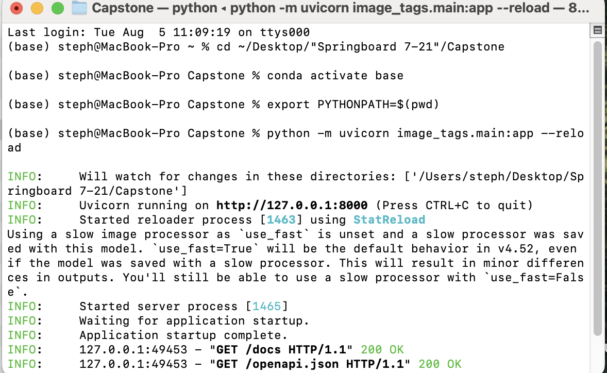

# Image Tagger API

An AI-powered image tagging API that generates captions and extracts semantic tags from images using the BLIP (Bootstrapping Language-Image Pre-training) model.

- Live demo (Gradio UI): https://stephenebert-image-tagger.hf.space/

- REST API docs (Swagger): https://stephenebert-image-tagger.hf.space/docs

- Health check: https://stephenebert-image-tagger.hf.space/healthz

- The Space serves both a friendly Gradio interface and a FastAPI backend.

## Features

- **Image Captioning**: Automatically generates descriptive captions for uploaded images
- **Semantic Tagging**: Extracts relevant tags from captions using natural language processing
- **Part-of-Speech Filtering**: Filter tags by nouns, adjectives, and verbs
- **FastAPI Backend**: RESTful API with automatic documentation
- **Multiple Image Formats**: Supports PNG and JPEG images
- **Metadata Persistence**: Saves caption and tag data as JSON sidecars
- **Gradio Frontend**: Drag-and-drop UI for quick testing.

The API for the HF space looks like this


## Live Demo (Hugging Face Space)
Upload an image in the Space and you’ll see the caption plus tags. Example response produced in the Space (https://huggingface.co/spaces/stephenebert/Image_Tagger):


and it outputs
``` bash
{
  "filename": "020_The_lion_king_Snyggve_in_the_Serengeti_National_Park_Photo_by_Giles_Laurent.jpg",
  "caption": "a lion rests on a rock in the wild",
  "tags": [
    "lion",
    "rests",
    "rock",
    "wild"
  ]
}
```

## Installation

### Prerequisites

- Python 3.8+
- pip package manager

### Dependencies

Install the required packages:

```bash
pip install fastapi uvicorn python-multipart
pip install torch torchvision transformers
pip install pillow nltk
```

### NLTK Data

The application automatically downloads required NLTK data (punkt tokenizer and POS tagger) on first run.

## Usage

### Starting the API Server

```bash
# From the project directory
uvicorn main:app --reload

# Or specify host and port
uvicorn main:app --host 0.0.0.0 --port 8000
```

The API will be available at `http://localhost:8000` with interactive documentation at `http://localhost:8000/docs`.




### API Endpoints

#### Health Check
```
GET /healthz
```
Returns server status.

#### Image Upload and Tagging
```
POST /upload
```

**Parameters:**
- `file` (required): PNG or JPEG image file
- `top_k` (optional): Maximum number of tags to return (1-20, default: 5)
- `nouns` (optional): Include noun tags (default: true)
- `adjs` (optional): Include adjective tags (default: true)
- `verbs` (optional): Include verb tags (default: true)

**Response:**
If we upload an image, say a cat or anything,


turn everything off except for nouns in the API


then the following json is outputted


```json
{
  "filename": "test_image.png",
  "caption": "a cat sitting on the ground",
  "tags": [
    "cat",
    "ground"
  ]
}
```

### Command Line Usage

You can also use the tagger directly from the command line:

```bash
python tagger.py path/to/image.jpg [top_k]
```

Example:
```bash
python tagger.py cat.jpg 10
# Output: tags: cat, sitting, sidewalk, orange, furry, outdoor, pavement, feline, relaxed, sunny
```

## How It Works

1. **Image Processing**: Uploaded images are converted to RGB format using PIL
2. **Caption Generation**: The BLIP model generates a descriptive caption
3. **Tag Extraction**: NLTK processes the caption to extract relevant words
4. **POS Filtering**: Tags are filtered by part-of-speech (nouns, adjectives, verbs)
5. **Metadata Storage**: Results are saved as JSON files in `~/Desktop/image_tags/`

## Configuration

### Model Details
- **Model**: Salesforce/blip-image-captioning-base
- **Framework**: Hugging Face Transformers
- **Maximum Caption Length**: 30 tokens

### File Storage
- JSON metadata files are stored in: `~/Desktop/image_tags/`
- Files are named using the original image filename stem
- Each JSON contains: caption, tags, and timestamp

## API Response Format

```json
{
  "filename": "string",
  "caption": "string", 
  "tags": ["string", "..."]
}
```

## Error Handling

- **415 Unsupported Media Type**: Only PNG and JPEG images are supported
- **400 Bad Request**: Image file cannot be decoded
- **422 Validation Error**: Invalid query parameters

## Examples

### Using curl

```bash
# Upload an image with default settings
curl -X POST "http://localhost:8000/upload" \
  -H "accept: application/json" \
  -H "Content-Type: multipart/form-data" \
  -F "file=@cat.jpg"

# Upload with custom parameters
curl -X POST "http://localhost:8000/upload?top_k=10&nouns=true&adjs=true&verbs=false" \
  -H "accept: application/json" \
  -H "Content-Type: multipart/form-data" \
  -F "file=@cat.jpg"
```

### Using Python requests

```python
import requests

url = "http://localhost:8000/upload"
files = {"file": ("cat.jpg", open("cat.jpg", "rb"), "image/jpeg")}
params = {"top_k": 8, "nouns": True, "adjs": True, "verbs": True}

response = requests.post(url, files=files, params=params)
print(response.json())
```

## Project Structure

```
image_tags/
├── __init__.py          # Package initialization
├── main.py              # FastAPI application
├── tagger.py            # Core tagging functionality
└── README.md           
```

## Development

### Running Tests

The API includes a health check endpoint for basic testing:

```bash
curl http://localhost:8000/healthz
```

### Interactive Documentation

Visit `http://localhost:8000/docs` for Swagger UI documentation or `http://localhost:8000/redoc` for ReDoc documentation.

## License

This project uses the BLIP model from Salesforce Research, which is available under the BSD 3-Clause License.


## Troubleshooting

**Model Loading Issues**: The BLIP model (~1GB) will be downloaded on first use. Ensure you have sufficient disk space and internet connectivity.

**NLTK Data**: If NLTK data download fails, manually download using:
```python
import nltk
nltk.download('punkt')
nltk.download('averaged_perceptron_tagger')
```

**Memory Requirements**: The BLIP model requires significant memory. Consider using a GPU for better performance with large images or high throughput scenarios.
