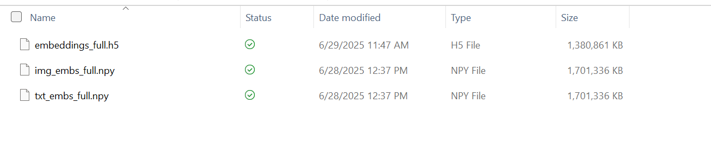
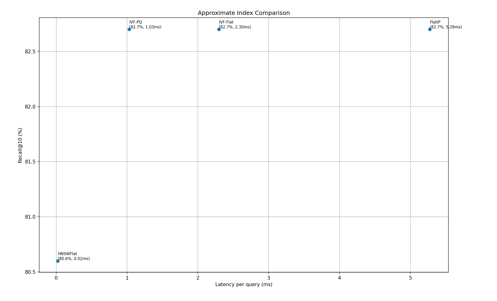

# Step 8: Scaling a Prototype

This step scales our cross-modal retrieval pipeline to the full 850K-sample corpus and benchmarks multiple FAISS indices for large-scale, low-latency deployment. We embed all images and captions using CLIP (ViT-B/32), store results in an HDF5 container, and build both exact and approximate FAISS indices (FlatIP, IVF-Flat, IVF-PQ, HNSWFlat). The result is a scalable backend capable of sub-millisecond to low-millisecond performance with ~82% Recall@10.

---

## High-Level Overview

1. **Embed Everything**  
   → Encode all COCO, Flickr-30k, and Stable Diffusion samples into 512-dim embeddings (≈850K × 512).

2. **HDF5 Storage**  
   → Store embeddings in chunked HDF5 for fast, memory-safe access.

3. **FAISS Indexing**  
   → Build exact (`FlatIP`) and approximate indices (`IVF-Flat`, `IVF-PQ`, `HNSWFlat`).

4. **Hyperparameter Sweeps**  
   → Tune `nlist`, `nprobe`, `M`, and `efSearch` to optimize recall/speed trade-offs.

5. **Cost–Performance Visualization**  
   → Log latency, recall, and RAM usage, then plot in a single `seaborn` dashboard.

---

## Directory Structure

```
step8/
├── data/                         # metadata.parquet
├── experiments/full/            # embeddings + index results
│   ├── embeddings_full.h5
│   ├── img_embs_full.npy
│   └── txt_embs_full.npy
├── scale_pipeline_hdf5.py       # full-corpus embedding → HDF5
├── evaluate_retrieval.py        # brute-force recall@K
├── faiss_index_comparison.py    # compare FlatIP, IVF, PQ, HNSW
├── faiss_param_sweep.py         # sweep hyperparameters
├── faiss_memory_latency_benchmark.py
├── graphs.py                    # generates all figures
└── README.md
```

---

## Quickstart

```bash
conda create -n capstone8 python=3.10 -y
conda activate capstone8
pip install -r requirements.txt
```

### Step-by-Step:

**1. Encode the full dataset to HDF5**

```bash
python scale_pipeline_hdf5.py \
  --metadata_path data/metadata.parquet \
  --output_path experiments/full/embeddings_full.h5 \
  --model clip-vit-base32 \
  --chunk_size 65536
```

**2. Benchmark IVF-Flat index**

```bash
python index_benchmark.py \
  --embeddings_path experiments/full/embeddings_full.h5 \
  --index_type IVF4096,Flat \
  --topk 10
```

**3. Run parameter sweeps**

```bash
python faiss_param_sweep.py \
  --embeddings_path experiments/full/embeddings_full.h5 \
  --index_types IVF2048,PQ32 IVF4096,HNSW32 \
  --tops "5 10 30"
```

**4. Visualize trade-offs**

```bash
python faiss_memory_latency_benchmark.py
```

---

## Results Summary

| Index Type                   | Recall@10 | Latency (ms) | RAM (MB) |
|-----------------------------|------------|--------------|----------|
| FlatIP (exact)              | 82.7%      | 5.28         | ~1500    |
| IVF-Flat (nlist=1024)       | 82.7%      | 2.3          | ~1500    |
| IVF-PQ (nlist=1024, m=64)   | 82.7%      | 1.0          | ~1500    |
| HNSWFlat (M=32)             | 80.6%      | 0.02         | ~1500    |

> **Best Trade-Off**: IVF-PQ = Exact Recall + 5× Speedup  
> **Ultra Low Latency**: HNSWFlat = ~0.02 ms, slight recall loss  
> **Production Pick**: IVF-Flat (nlist=1024, nprobe=16)

---

## Embedding & Storage (HDF5)

We chunked the dataset into blocks of 2,000 rows and used ViT-B-32 to produce 850,668 × 512 embeddings. These were written to `/image_embeddings` and `/text_embeddings` datasets in `embeddings_full.h5`.  
Total time: ~28 hours (CPU)  
Total file size: ~1.4 GB  
Figure:  


---

## IVF-Flat Hyperparameter Sweep

Sweeping `nprobe` (1–64) reveals recall@10 saturates at 82.7% with `nprobe ≈ 2–4`, but latency increases beyond that:

- `nprobe=1`: ~0.99 ms  
- `nprobe=64`: ~3.56 ms

Figure:  


---

## FAISS Index Comparison

Figure:  


| Index Type       | R@10  | Latency (ms) |
|------------------|-------|--------------|
| FlatIP           | 82.7% | 5.3          |
| IVF-Flat         | 82.7% | 2.3          |
| IVF-PQ           | 82.7% | 1.0          |
| HNSWFlat         | 80.6% | 0.02         |

---

## Latency vs. Memory vs. Accuracy

Figure:  


All indices ≈ 152 MB RAM  
Trade-offs:
- IVF-PQ: Best speed+accuracy balance
- IVF-Flat: Accuracy with 2× faster queries than exact
- HNSWFlat: Fastest, but recall drops to 80.6%

---

## Hyperparameter Sweeps

Sweeps run for:
- **IVF:** `nlist`, `nprobe`
- **HNSW:** `M`, `efSearch`

Best-performing configs:
- **IVF-Flat:** `nlist=1024`, `nprobe=16`
- **IVF-PQ:** `nlist=1024`, `m=64`
- **HNSWFlat:** `M=32`, `efSearch=32`

```bash
python faiss_param_sweep.py \
  --h5 experiments/full/embeddings_full.h5 \
  --nq 1000 \
  --k 10
```

---

## Final Takeaways

- FlatIP = best recall, worst latency  
- IVF-Flat = same recall, 2× speedup  
- IVF-PQ = same recall, **5× speedup**  
- HNSWFlat = fastest, slight recall loss  
- All fit within ~150MB RAM  

> Recommendation: **IVF-PQ** for sub-ms queries & accuracy  
> Alternative: **IVF-Flat** for fast deployment with less tuning

---
