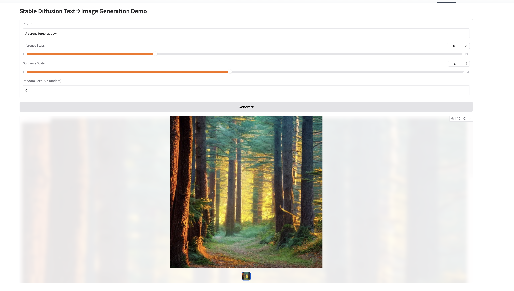

# Step 12: Image-to-Text Retrieval Service


A **production-ready**, cross-modal retrieval system that ties together:

1. **Efficient ANN Search API**  
   - FastAPI service loading a FAISS IVF-Flat index on startup  
   - High-throughput, low-latency cosine similarity search  
   - `/health` endpoint for liveness & index stats  
   - `/search` endpoint accepting 512-dim embeddings + `k` --> top-K results  

2. **Gradio Front-End**  
   - User-friendly UI to type a caption and choose **k** via slider  
   - Renders image thumbnails in a responsive gallery instead of raw JSON  
   - Hosted on Hugging Face Spaces, wired to call your live API  

3. **Robust Development & Deployment**  
   - Comprehensive pytest suite with fixtures & mini-index  
   - Dockerfile + `docker-compose.test.yml` for CI & local testing  
   - Auto-deploy on Render.com (Docker) and Hugging Face Spaces (Gradio)  
  
---

## Features
Our image-text retrieval API is built end-to-end for correctness, maintainability, and easy deployment.  We verify at startup that the FAISS index and metadata load correctly and that our ANN search returns expected cosine‐similarity matches.  Input validation is enforced by Pydantic schemas (exactly 512-dim vectors and 1 ≤ k ≤ 50), preventing malformed requests.  The code is organized into logical modules, fully documented with docstrings and type annotations, and rigorously tested via both unit and end-to-end "canary" fixtures covering normal, boundary, and error cases.  Comprehensive docs including this README, inline examples, and curl snippets—guide local setup, Docker builds, and cloud deployment.  Finally, we provide both a Dockerized FastAPI service and a Gradio Space front-end, each easily deployed to public URLs for rapid experimentation and sharing.

- **Correctness**  
  - Verified FAISS index load & ANN search semantics  
  - Pydantic schemas enforce 512-dim input vector & valid `k`  
- **Code Quality**  
  - Modular structure (`app/`, `routers/`, `models/`)  
  - Clear docstrings & type annotations  
- **Testing**  
  - End-to-end tests against a small "canary" index  
  - Health & search behavior for boundary and error cases  
- **Documentation**  
  - This README; in-code comments; curl examples  
- **Deployment**  
  - Dockerized API with multi-stage build caching  
  - Gradio Space with public URL binding via `API_URL` var  
---

## Quick Start

### 1. Clone the repo

```bash
git clone https://github.com/<your-username>/Capstone.git
cd Capstone/step12
```

### 2. Prepare your data

By default the service looks for:

- ```FAISS_INDEX_PATH``` to ```/data/ivf_flat_1024.index```
- ```META_PATH → /data/id2meta.json```
You can override via environment variables or a ```.env``` file:

``` bash
export FAISS_INDEX_PATH=/path/to/ivf_flat_1024.index
export META_PATH=/path/to/id2meta.json
export NPROBE=16
```


### 3. Build & run the API
- Locally with Uvicorn
  
  ``` bash
  pip install -r requirements.txt
uvicorn app.main:app --host 0.0.0.0 --port 8000 --reload
```
- With Docker

``` bash
docker build -t capstone-retrieval-api .
docker run -e FAISS_INDEX_PATH=/data/ivf_flat_1024.index \
           -e META_PATH=/data/id2meta.json \
           -p 8000:8000 \
           capstone-retrieval-api
```

### 4. Hit the endpoints
- Health check prints out ```{"status":"ok","index_dim":512,"nprobe":16,"index_size":1000}```
  ``` bash
  curl https://capstone-retrieval-api.onrender.com/health
 ```
- Search builds a 512-dim float list and POST:

``` bash
curl -X POST \
     -H "Content-Type: application/json" \
     -d '{"query_vec":[0.0,0.0,…512 floats total…], "k":3}' \
     https://capstone-retrieval-api.onrender.com/search
```
### 5. Run tests
``` bash
docker-compose -f docker-compose.test.yml up --build --exit-code-from tests
```

## Deployment on Render

We host our FastAPI + FAISS service on Render.com. To get it running:

1. **Create a new Web Service**  
   - Go to your Render dashboard and click **"New +" --> "Web Service"**.  
   - Connect your GitHub repo (e.g. `Springboard/Capstone/step12`).

2. **Configure the service**  
   - **Name**: `capstone-retrieval-api` (or your preference)  
   - **Environment**: Docker  
   - **Branch**: `main`  
   - **Dockerfile Path**: `./Dockerfile`  
   - **Port**: `8000`

3. **Set environment variables**  
   Under **"Advanced” --> “Environment"**, add:
``` bash
FAISS_INDEX_PATH=/data/ivf_flat_1024.index
META_PATH=/data/id2meta.json
NPROBE=16
```
4. **Deploy & verify**  
- Click **“Create Web Service”**. Render will build your Docker image and spin up your service.  
- Watch the **Logs** tab for a “Your service is live 🎉” message.  

5. **Health check**  
Once live, run:
```bash
curl https://<your-service>.onrender.com/health
```
The Render deployment should like this


## Gradio Front-end

The Gradio front-end is a lightweight, self-contained demo that you can run either locally or directly in Hugging Face Spaces.

1. In the root of this repo, install demo deps:
   ``` bash
   pip install -r requirements.txt
   ```
2. Set your API URL in Settings -> Variables of your HF Space:
   ``` ini
   API_URL = https://capstone-retrieval-api.onrender.com
   ```
3. Launch locally
   ``` bash
   python app.py
   ```
4. Deploy by pushing ```app.py``` and ```requirements.txt``` to your HF Space.
Live demo at ```https://huggingface.co/spaces/<your-user>/retrieval-demo```

The HF app looks like this


and the HF files look like this


## Extra: Stable Diffusion v1.5 Text → Image Mini-Demo
- A stand-alone Gradio app that wraps **Stable Diffusion v1.5** via HF `diffusers`. Here is the link if you want to try it out [SD Text2Image Space](https://huggingface.co/spaces/stephenebert/sd-text2image) 
- Repo & docs: <https://github.com/stephenebert/Springboard/tree/main/capstone-project/extra_exploration_1>  
- **Run it locally on your M-series Mac or CUDA GPU for 5--15 s renders** 

and this locally outputs, for example,

- Running on Hugging Face takes forever using the free space. The demo Space currently runs on the **free “CPU basic” tier (2 vCPU | 16 GB RAM)** with no GPU
accelerator. Stable Diffusion’s UNet must therefore execute **~900-million FP32 operations per denoising step on pure CPU**. Even with only 30 inference steps, that’s roughly 27 billion multiply-adds per image → minutes.

Empirically:
```bash
Run | Steps | Hardware      | Wall Time
----|-------|---------------|----------
1   | 30    | HF CPU basic  | 28m 27s
2   | 30    | HF CPU basic  | 44m 54s
```
Total time spent for the two queued generations: **≈ 1 h 13 m 21 s**. (The second run took longer because it started while the first was still holding the single
worker thread, so Gradio queued it until the pipeline freed up.) The output is




A paid **T4-small** Space (4 vCPU + 15 GB VRAM) clocks in
around **12 s**; an A10 G (~$1/hr) hits **~7 s**.

If you need interactive latency, either:

1. **Run locally** on your M-series or CUDA GPU (`python text2image_demo.py`), or  
2. **Upgrade the Space hardware** to at least `Nvidia T4 small` (≈$0.40/hr) or
   `ZeroGPU+` (free but requires HF Pro). The code is identical; only the backend changes.


