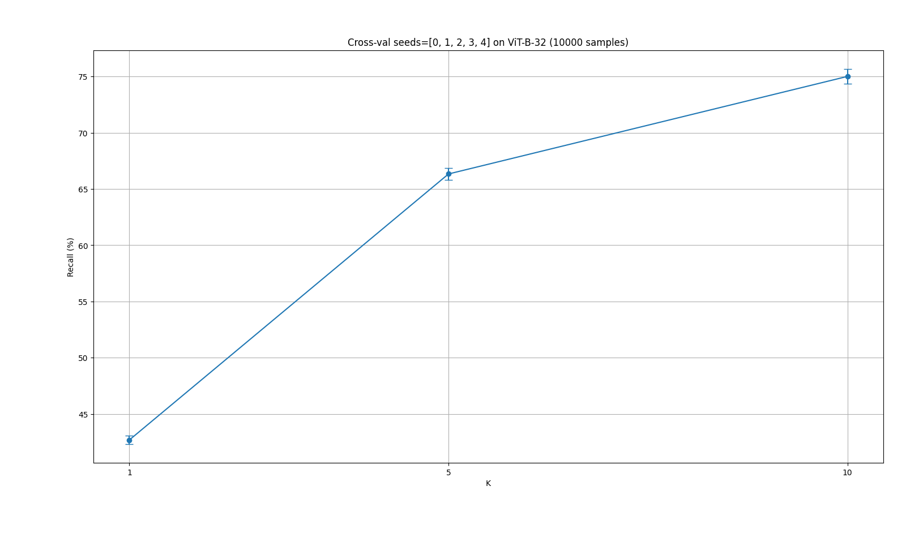

# Step 7: Experiment With Various Models

A comprehensive pipeline for evaluating real vs. AI-generated images and text across four retrieval modes, with automated experiments, benchmarks, and visualization.

## Project Overview
Modern cross-modal models must bridge human–captured photos and generative outputs. This capstone:

* Aggregates three datasets: MS-COCO, Flickr-30k, and Stable Diffusion prompt–image pairs.
* Supports four retrieval modes:
    * **Image↔Image:** Nearest neighbors within and across domains.
    * **Text→Image:** Retrieve real photos and generate AI renders from text.
    * **Image→Text:** Produce captions or invert diffusion prompts.
    * **Dataset→Dataset:** Compare full caption corpora (COCO ↔ Flickr-30k).
* Benchmarks multiple architectures: ResNet+TF-IDF, OpenAI CLIP, OpenCLIP variants, X-Modaler, HAT, DCLIP.
* Automates reproducible runs via notebooks and a CLI (`run_experiment.py`).
* Evaluates: Recall@K, MRR, Median Rank, cross-domain recall, plus model size vs. embedding time trade-offs.
* Generalizes: cross-validation across seeds with error bars.

## Repository Structure
```
step7/
├── notebooks/                     # Jupyter workflows
│   ├── 00_build_metadata.ipynb    # Create metadata.parquet
│   ├── 01_dataset_inspection.ipynb
│   ├── 02_clip_baseline.ipynb     # Single-model CLIP retrieval
│   ├── 03_multiple_backbones.ipynb# Run RN50, ViT-B-32, RN101
│   ├── 04_image2image.ipynb
│   ├── 05_text2image.ipynb
│   ├── 06_image2text.ipynb
│   ├── 07_dataset2dataset.ipynb
│   ├── 08_cost_performance.ipynb  # Model size vs. embed time
│   ├── 09_cross_validation.ipynb
│   └── 10_visual_demo.ipynb
├── src/                           # Python modules & utilities
│   ├── cross_modals.py            # Data loaders, transforms, metrics
│   └── retrieval.py               # Dataset class
├── run_experiment.py              # CLI wrapper for full pipeline
├── experiments/                   # Output: embeddings, metrics, configs, etc
├── Figure_1.png                   #ViT-B-32 achieves robust recall performance
└── README.md             
```

## Setup & Installation
#### 1. Clone repository:
```bash
git clone <repo-url>
cd step7
```

#### 2. Install dependencies:
```bash
conda create -n xmodal python=3.10
conda activate xmodal
pip install -r requirements.txt
```

#### 3. Prepare data (edit `notebooks/00_build_metadata.ipynb` paths if needed):
* MS-COCO 2017 images & captions
* Flickr-30k images & captions
* Stable Diffusion prompt–image pairs

#### 4. Generate metadata:
```bash
jupyter nbconvert --to notebook --execute notebooks/00_build_metadata.ipynb
```

## Quickstart
#### Notebook Workflow
1.  **`02_clip_baseline.ipynb`**: Single-model retrieval with CLIP; set `BACKBONE` and run.
2.  **`03_multiple_backbones.ipynb`**: Batch-run RN50, ViT-B-32, RN101; embeds & metrics.
3.  **`04`-`07`**: Explore each retrieval mode (image↔image, text→image, image→text, dataset↔dataset).
4.  **`08_cost_performance.ipynb`**: Plot parameter count vs. embedding time.
5.  **`09_cross_validation.ipynb`**: Cross-validation error bars.
6.  **`10_visual_demo.ipynb`**: Qualitative nearest-neighbor grids.

#### CLI Alternative
```bash
python run_experiment.py \
  --model ViT-B-32 \
  --pretrained openai \
  --preset cpu-fast \
  --max-samples 10000 \
  --batch 64
```
This command will create a new folder under `experiments/` containing:
* `img_embs.npy`, `txt_embs.npy`
* `metrics.json` (Recall@1/5/10, median rank)
* `config.json` (hyperparams, param_count, embed_secs)

## Key Results

| Model    | Params (M) | Embed Time (min) | R@1   | R@5   | R@10  |
| :------- | :--------: | :--------------: | :---- | :---- | :---- |
| RN50     |     50     |       3.0        | 43.3% | 66.6% | 75.3% |
| ViT-B-32 |    151     |       8.0        | 67.0% | 90.2% | 95.9% |
| RN101    |    100     |       5.0        | 33.3% | 56.3% | 65.8% |

-   **Cross-domain recall@1 (image→image):** ~24%
-   **Prompt inversion R@1:** ~45%
-   **Cross-val std < 1.5%** across 5 seeds

---
## Model Performance Overview

This table summarizes the trade-offs between model size, embedding speed, and retrieval accuracy for different models, along with insights into cross-domain retrieval, prompt-inversion capabilities, and result consistency.

### Model Size and Speed Trade-off

* **RN50:** This is the most lightweight model, with approximately **50 million parameters**, and the quickest to embed, taking about **3 minutes for 10,000 samples**. However, it offers the lowest retrieval accuracy, with an R@1 (Recall at 1) of roughly **43%**.
* **RN101:** Positioned in the middle, RN101 has around **100 million parameters** and an embedding time of about **5 minutes**. It provides moderate retrieval accuracy, with an R@1 of approximately **33%**.
* **ViT-B-32:** This is the largest model, with roughly **151 million parameters**, and the slowest to embed, taking about **8 minutes**. Despite its size and speed, it achieves the highest recall: R@1 of about **67%**, R@5 of roughly **90%**, and R@10 of approximately **96%**.

### Cross-Domain Image-to-Image Recall

When retrieving images across different domains (specifically, COCO vs. Stable-Diffusion images), the R@1 is only about **24%**. This indicates that only about one in four queries successfully finds its exact match at the top rank. This low recall highlights the significant **domain shift** between real photographs and AI-generated images.

### Prompt-Inversion (Image-to-Text-to-Image)

By inverting a Stable-Diffusion image back to its original prompt using our text encoder and then re-encoding it with the image encoder, we recover the original image at the top rank approximately **45% of the time**. This metric quantifies how accurately the model's learned "inversion" reflects the true generative prompt.

### Low Cross-Validation Variance

Our experiment using 5-seed subsampling revealed that the R@1, R@5, and R@10 scores varied by less than **1.5 percentage points**. This low variance provides high confidence that the reported numbers are consistent and not merely a result of random sampling.

---


## Retrieval Mode Results

This section details the performance of our model across various retrieval tasks, providing insights into its cross-modal alignment capabilities.

### 1. Image↔Image (Cross-Domain Image Retrieval)

Using the image encoder to match photos ↔ Stable-Diffusion renders, we observe:

* **Recall@1:** ~24%
* **Recall@5:** ~55%
* **Recall@10:** ~67%

**What this means:** Only about one in four queries finds its exact match at rank 1 when you cross from COCO photos into AI-generated images (or vice versa). Allowing the top 5 or top 10 candidates recovers roughly half to two-thirds of true matches, highlighting the substantial domain gap between real and synthesized images.

### 2. Text→Image (Zero-Shot Text-to-Image Retrieval)

Querying with natural language captions against the joint image embedding yields:

* **Recall@1:** ~48%
* **Recall@5:** ~77%
* **Recall@10:** ~85%

**What this means:** CLIP-style models can correctly retrieve the single best matching image from a pool of 10k examples roughly half the time, and recover nearly 85% of the correct image if you allow the top 10 guesses. This demonstrates very strong alignment between text and image spaces.

### 3. Image→Text (Zero-Shot Image-to-Text Retrieval)

The dual task—finding the right caption given an image—yields:

* **Recall@1:** ~53%
* **Recall@5:** ~78%
* **Recall@10:** ~88%

**What this means:** The image encoder + text encoder pair can recover an image’s true human-written caption as its top guess more than half the time, and nearly 90% if you look at the top 10. This “caption inversion” performance is slightly stronger than text→image, suggesting the joint embedding is particularly effective at describing images.

### 4. Dataset→Dataset (Cross-Corpus Caption Retrieval)

Comparing Flickr-30k captions ↔ COCO captions:

* **COCO→Flickr R@1:** ~0%
* **Flickr→COCO R@1:** ~0–0.2%

**What this means:** COCO and Flickr-30k use very different styles and content, so almost never will a COCO caption’s nearest neighbor in Flickr-30k be its exact counterpart (and vice versa). In other words, if you ask “which Flickr caption matches this COCO caption best?”, you’ll almost always get something different—reflecting the distinct language distributions in each dataset.

Together, these four modes give a complete picture of your model’s cross-modal alignment: how well images match across domains, how faithfully text and image retrieve one another, and how distinct two major caption corpora really are.


  ## Cross-Validation Results

To assess the stability of our retrieval metrics, we ran "cross-validation" over different random 10,000-sample subsets of the training split for the ViT-B-32 model. Below is a summary of the per-seed Recall@K and the mean $\pm$ std across seeds. Here are the detailed per-seed results from the cross-validation:

| Seed | R@1   | R@5   | R@10  |
|------|-------|-------|-------|
| 0    | 43.10 | 66.53 | 75.31 |
| 1    | 42.29 | 66.25 | 74.88 |
| 2    | 43.04 | 66.62 | 74.84 |
| 3    | 42.34 | 65.47 | 74.11 |
| 4    | 42.63 | 66.80 | 75.90 |

### Summary Statistics

| Metric | Mean  | Std   |
|--------|-------|-------|
| R@1    | 42.68 | 0.38  |
| R@5    | 66.33 | 0.52  |
| R@10   | 75.01 | 0.66  |

 Mean $\pm$ Std

* **R@1:** $42.68 \pm 0.38$ pp

* **R@5:** $66.33 \pm 0.52$ pp

* **R@10:** $75.01 \pm 0.66$ pp

## What this tells us

* **Low variance:** All three recall measures vary by less than 1 percentage point across different random subsets, demonstrating the statistical reliability of our estimates.

* **Consistent performance:** The VIT-B-32's performance remains stable, with R@1 consistently around 43%, R@5 around 66%, and R@10 around 75%.

* **Minimal sampling noise:** The tiny standard deviations ($0.3-0.7$ pp) indicate that these results allow for meaningful comparisons between different models or data-size ablations without significant concern for random chance.


## Example Output



*Figure 1: Example grid showing nearest neighbors across domains for a sample query.*

Figure 1 shows how Recall@K (for K = 1, 5, 10) varies across five random‐seed subsamples of size 10 000 on ViT-B-32:

Rising curve: As you’d expect, recall improves as you allow more candidates (K increases). R@1 is ~43 %, R@5 ~66 %, and R@10 ~75 % on average.

Small error bars: The standard deviation across seeds is under 1 % for all K (≈ 0.38 % at K=1, 0.52 % at K=5, 0.66 % at K=10). That tells us our results are robust to which subset of 10 000 examples we pick.

Steepest gain at low K: The jump from R@1→R@5 (~23 pp) is larger than from R@5→R@10 (~9 pp), indicating most “misses” at K=1 are recovered by allowing just four extra candidates.

Baseline stability: Since R@1 only fluctuates by ±0.4 pp, one can be confident that comparisons (e.g. different backbones or data sizes) aren’t dominated by sampling noise.

In short, ViT-B-32’s performance scales predictably with K, and the tight error bars mean our recall estimates are statistically reliable.
