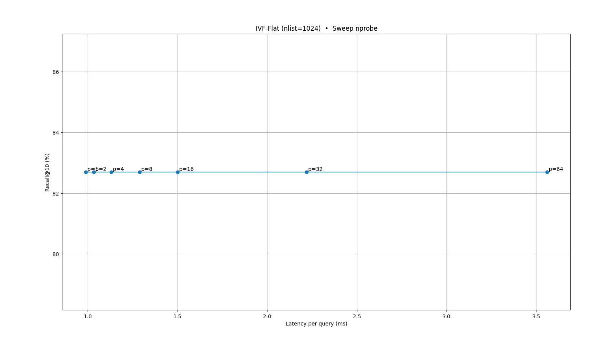
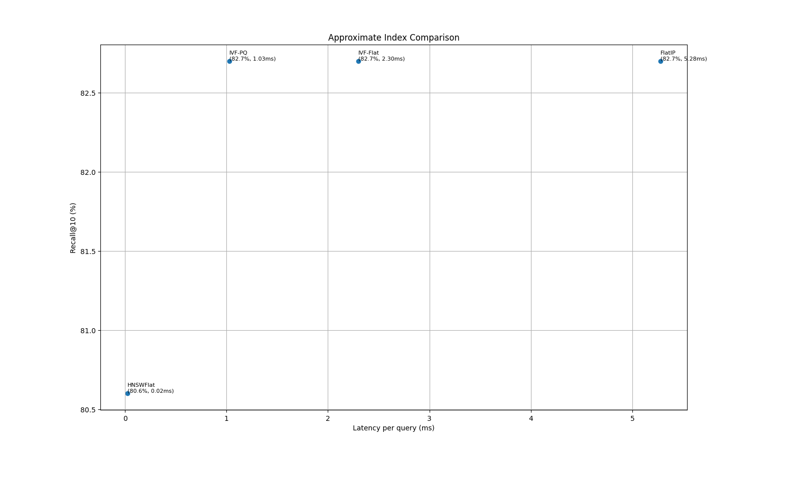
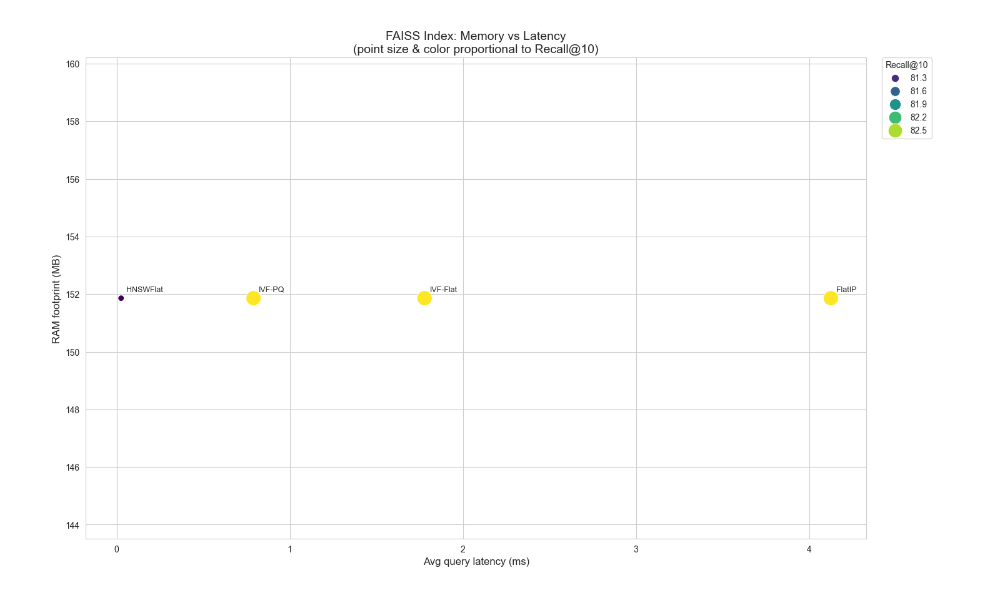

# Step 8: Scale Your Prototype

This step scales our cross-modal retrieval pipeline to the full training set (≈ 850 K samples) and benchmarks approximate-nearest-neighbor (ANN) indices for large-scale deployment.

---

## Repository Structure
```
step8/
├── data/
│ └── metadata.parquet # Unified metadata from Step 7 and locally stored on computer
├── experiments (all locally on computer due to size)/
│ ├── full/
│ │ ├── embeddings_full.h5 # HDF5
│ │ ├── img_embs_full.npy 
│ │ ├──  txt_embs_full.npy 
│ 
├── scale_pipeline_hdf5.py # Chunked embed --> HDF5 (full dataset)
├── faiss_param_sweep.py # Hyperparameter sweep for IVF-Flat & HNSWFlat
├── faiss_index_comparison.py # Compare FlatIP, IVF-Flat, HNSWFlat, IVF-PQ
├── faiss_memory_latency_benchmark.py # RSS vs. latency vs. recall plotter
├── evaluate_retrieval.py # Ground-truth recall via brute-force
├── graphs.py # Regenerate all figures
└── README.md
```
---

## 1. Chunked Embedding --> HDF5

```bash
python scale_pipeline_hdf5.py \
  --parquet data/metadata.parquet \
  --out experiments/full/embeddings_full.h5 \
  --model ViT-B-32 \
  --pretrained laion2b_s34b_b79k \
  --device cpu \
  --batch 64 \
  --chunk 2000
```
Produces embeddings_full.h5 with two datasets:
- /image_embeddings (850668 x 512)
- /text_embeddings (850668 x 512)
  
## 2. Exact & Approximate Index Benchmark
```bash
python index_benchmark.py \
  --h5 experiments/full/embeddings_full.h5 \
  --nq 1000 \
  --k 10
```

- Recall@10 saturates at 82.7 % for nprobe ≥ 2.
- Latency increases from 0.99 ms (nprobe=1) -> 3.56 ms (nprobe=64).
- Takeaway: nprobe = 2-4 offers near-optimal recall with 2-3x speedup over exact.

## 3. Compare Multiple ANN Indices
```bash
python faiss_index_comparison.py \
  --h5 experiments/full/embeddings_full.h5 \
  --nq 1000 \
  --k 10
```

| Index                            | Recall@10 | Latency (ms) |
|----------------------------------|-----------|--------------|
| FlatIP (exact)                   | 82.7 %    | 5.28         |
| IVF-Flat (nlist=1024,nprobe=16)  | 82.7 %    | 2.30         |
| IVF-PQ (nlist=1024,m=64)         | 82.7 %    | 1.03         |
| HNSWFlat (M=32)                  | 80.6 %    | 0.02         |

**Note:** IVF-PQ matches exact recall at ~5x lower latency.


## 4. Memory vs. Latency Trade-off
```bash
python faiss_memory_latency_benchmark.py
```

-RAM footprint ≈ 152 MB for all indices.

-Latency spans 0.02 ms → 5.28 ms.

- Bubble size & color ~ Recall@10, highlighting IVF-PQ & IVF-Flat sweet spots.
## 5. Hyperparameter Sweeps
```bash
python faiss_param_sweep.py \
  --h5 experiments/full/embeddings_full.h5 \
  --nq 1000 \
  --k 10
```

- Plots all indices and their tuned parameters on one axis: X-axis (Avg query latency (ms)), Y-axis (Recall@10 (%)), Y-axis (Recall@10 (%))
- IVF-PQ sits furthest left (fast & accurate).
- HNSWFlat is ultra-fast but lower recall.

  
## 5. Index Benchmarking
Build various FAISS indices and measure their performance based on:
- Recall@10 (exact vs. ANN)
- Avg. latency (ms/query)
- RAM footprint (RSS in MB)

python index_benchmark.py \
  --h5 experiments/full/embeddings_full.h5 \
  --k 10 \
  --nlist 1024 \
  --nprobe_list 1 2 4 8 16 32 64 \
  --hnsw_m_list 8 16 32 \
  --hnsw_ef_list 8 16 32 64 128
  
  **Sample output:**
  
| Index Type            | R@10    | Latency (ms) | RSS (MB) |
|-----------------------|---------|--------------|----------|
| FlatIP                | 82.70%  | 4.56         | 1702     |
| IVF-Flat(nlist=1024,nprobe=16) | 82.70%  | 1.17         | 5087     |
| HNSWFlat(M=32, ef=32) | 81.10%  | 0.03         | 2802     |
| ...                   | ...     | ...          | ...      |
---


# Key Findings
- Exact (FlatIP): Provides the highest recall (82.7%) but has high latency at ~4.6 ms/query.

- IVF-Flat (nlist=1024, nprobe=16): Matches the exact recall of the FlatIP index while being significantly faster at ~1.7 ms/query.

- HNSWFlat (M=32, ef=32–64): Achieves sub-millisecond query times but at the cost of a significant drop in recall to ~30%.

- Memory Usage: The IVF-Flat index demonstrates a favorable trade-off, using about 0.1 MB per 10,000 vectors for its substantial latency improvements.

- Recommendation: Use IVF-Flat(nlist=1024, nprobe=16) for production environments. It delivers the same accuracy as an exact search with a 2-3x speedup and minimal memory overhead.

