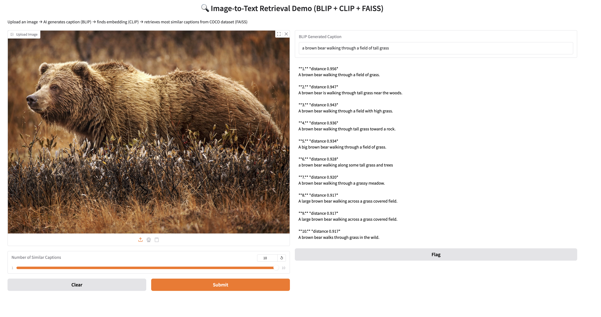

# Capstone Project: Cross-Modal AI Systems - Retrieval and Generation

**Author**: Stephen Ebert  
**Bootcamp**: Machine Learning Engineering - Springboard  
**Model Types**: Deep Learning + Cross-Modal Retrieval  + Stable Diffusion
**Frontend**: Gradio  
**Backend**: FastAPI + FAISS  
**Deployment**: Docker, Hugging Face Spaces, Render.com  

---

## Overview

This capstone project demonstrates comprehensive **cross-modal retrieval systems** with two complementary applications:

1. **Text-to-Image Retrieval**: Users input text queries to retrieve matching images from a large-scale embedding database
2. **Image-to-Text Retrieval**: Users upload images to find similar captions using BLIP → CLIP → FAISS pipeline
3. ***Stable Diffusion Text-to-Image Generation***: Users generate 512×512 images from text prompts using Stable Diffusion v1.5

All systems are optimized for performance (via FAISS ANN search and GPU acceleration) and usability (via Gradio interfaces), demonstrating full-stack ML engineering competencies from data collection to production deployment.

---

## Repository Structure

```
capstone-project/
├── extra_exploration/
│   ├── data/
│   │   ├── README.md                # FAISS building guide
│   │   ├── UI1.png                  # demo screenshot
│   │   ├── UI2.png                  # additional screenshot
│   │   ├── coco.png                 # COCO example image
│   │   ├── coco2.png                # COCO example image
│   │   └── terminal.png             # terminal output example
│   └── scripts/
│       ├── blip_round_trip.py       # BLIP processing script
│       ├── build_coco_text_index.py # COCO index builder
│       ├── generate_blip_caption.py # caption generation
│       ├── coco_caption_clip.index  # 591,753 × 512 float32 vectors
│       └── coco_caption_texts.npy   # array of captions aligned with index order
|── extra_exploration_1/
│   ├── images/                      # screenshots for Stable Diffusion demo
│   │   ├── bear walking in SD.png   # SD generation example
│   │   ├── cyber punk SD.png        # SD generation example
│   │   └── terminal.png             # terminal output
│   ├── text2image_demo.py           # Stable Diffusion demo app
│   ├── requirements.txt             # SD-specific requirements
│   ├── pyaudioop.py                 # Python 3.13+ compatibility shim
│   └── README.md                    # SD documentation
├── images/
│   ├── Screenshot 2025-07-14 004105.png  # Text-to-Image UI
│   └── Screenshot 2025-07-14 004518.png  # Deployment logs
├── images/
├── phase1/
│   ├── step1_initial_project_ideas/
│   ├── step2_data_collection/
│   ├── step3_project_proposal/
│   ├── step4_survey_existing_research/
│   ├── step5_data_wrangling/
│   └── step6_benchmark_model/
├── phase2/
│   ├── step7_experiment_models/
│   ├── step8_scale_prototype/
│   ├── step9_deployment_method/
│   ├── step10_deployment_design/
│   ├── step11_deployment_implementation/
│   └── step12_share_project/
├── gradio_demo.py                    # Image-to-Text demo app
├── environment.yml                   # Conda environment
├── requirements.txt                  # pip requirements
└── README.md
```

---

## Key Features

### Machine Learning Engineering
- **Deep Learning Feature Extractors**: CLIP and BLIP via Hugging Face Transformers
- **Generative Models:** Stable Diffusion v1.5 for text-to-image synthesis
- **Vector Storage & Indexing**: Efficient cosine similarity search via FAISS IVF-Flat and IndexFlatL2
- **Data Preprocessing Pipelines**: HDF5, JSONL, COCO-format parsing
- **Evaluation Metrics**: Top-K accuracy, cosine similarity thresholds
- **Cross-Modal Understanding**: Text ↔ Image semantic matching

### Software Architecture
- **FastAPI service** with `/health` and `/search` endpoints for production text-to-image retrieval
- **Gradio interfaces** for both text-to-image and image-to-text interactive demos
- **Modular codebase** with proper type hints and docstrings
- **Test suite** with unit + smoke tests
- **Cross-platform support:** CUDA, Apple Silicon (MPS), and CPU backends
- **Monitoring** via Prometheus (optional)

### Deployment
- **Dockerized** services with `Dockerfile` and `docker-compose.yml`
- **CI-ready** with GitHub Actions
- **Public deployment** on:
  - [Render.com (FastAPI API)](https://capstone-retrieval-api.onrender.com)
  - [Hugging Face Spaces (Gradio UI)](https://huggingface.co/spaces/<your-username>/retrieval-demo)
- **Local development** with conda/pip environments

---

## Applications

### 1. Text-to-Image Retrieval System

**Explanations:**
1. A **text query** is converted into a 512-dim embedding via CLIP
2. The query is passed to a **FastAPI server**, which runs cosine similarity search against a pre-indexed FAISS database
3. The top-K image IDs are returned with metadata and rendered by Gradio as thumbnails

**Production Features:**
- RESTful API with OpenAPI documentation
- Scalable vector search with FAISS IVF-Flat indexing
- Docker containerization for consistent deployment
- Health checks and monitoring endpoints

### 2. Image-to-Text Retrieval Demo

**Explanations:**
1. **Upload an image** via file picker, webcam, or copy-paste
2. **BLIP** generates a descriptive caption
3. **CLIP** encodes that caption to a 512-D embedding
4. **FAISS** finds the *k* most similar captions from MS-COCO corpus
5. Ranked results (distance ↓ = similarity ↑) are displayed

**Interactive Features:**
- Multiple image input methods (upload, webcam, paste)
- Real-time caption generation
- Instant similarity search results
- Visual feedback with confidence scores

### 3. Stable Diffusion Text-to-Image Generation
insert image

**Explanations**
1. **Text Prompt:** CLIP Text Encoder to Text Embedding
2. **Scheduler (DDIM):** Iterative Denoising in Latent Space
3. **Random Noise:** UNet (guided by text embedding)
4. **Final Latent:** VAE Decoder to 512-by-512 RGB Image

## Interactive Features:

| Control                         | Purpose                                                                 |
|---------------------------------|-------------------------------------------------------------------------|
| **Prompt** *textbox*            | The text you want to turn into an image.                                |
| **Inference Steps** *slider*    | How many denoising steps to run (≈ quality vs. speed).                  |
| **Guidance Scale** *slider*     | `CFG` scale — how strongly the model follows your prompt.               |
| **Seed** *field*                | 0 or blank → random; any other *int* means re-generate exactly the same *image*. |

**Technical Features**
- Auto-detects GPU (CUDA, Apple Metal/MPS, or CPU)
- Zero bulky assets: model pulled & cached automatically
- Cross-platform compatibility
- Two-column Gallery with download buttons

---

## Quick Start Guide

### Prerequisites

Choose your preferred environment setup:

#### Option 1: Conda (Recommended)
```bash
git clone https://github.com/<your-username>/capstone-project.git
cd capstone-project

# Create exact working environment (Python 3.10 · NumPy 2.x · FAISS 1.11)
conda env create -f environment.yml
conda activate capstone-gradio-py310
```

#### Option 2: Virtual Environment
```bash
python -m venv .venv
source .venv/bin/activate          # Windows: .venv\Scripts\activate
pip install --upgrade pip
pip install -r requirements.txt
```

### Running the Applications

#### 1. Text-to-Image Retrieval (Production API)

**Setup Environment Variables:**
```bash
export FAISS_INDEX_PATH=/data/ivf_flat_1024.index
export META_PATH=/data/id2meta.json
export NPROBE=16
```

**Run Locally:**
```bash
uvicorn app.main:app --host 0.0.0.0 --port 8000 --reload
```

**Run with Docker:**
```bash
docker build -t capstone-retrieval-api .
docker run -e FAISS_INDEX_PATH=/data/ivf_flat_1024.index \
           -e META_PATH=/data/id2meta.json \
           -p 8000:8000 \
           capstone-retrieval-api
```

**API Testing:**
```bash
# Health check
curl https://capstone-retrieval-api.onrender.com/health

# Sample search
curl -X POST -H "Content-Type: application/json" \
  -d '{"query_vec":[0.1, 0.2, ..., 512 floats], "k":3}' \
  https://capstone-retrieval-api.onrender.com/search
```

#### 2. Image-to-Text Retrieval (Interactive Demo)

```bash
python gradio_demo.py
```

Open the URL printed in terminal (e.g., `http://127.0.0.1:7860`) and upload an image.

For public access, edit `gradio_demo.py` → `demo.launch(share=True)`.

### 3. Stable Diffusion Text-to-Image Generation
``` bash
cd extra_exploration_1
pip install -r requirements.txt
python text2image_demo.py
```
For Apple Silicon users (recommended):
``` bash
# Optional but recommended for M-series Macs
pip install --pre torch torchvision torchaudio --index-url https://download.pytorch.org/whl/nightly/cpu
```
---

## Data Sources & Preprocessing

### Datasets
- **COCO Captions**: 591,753 human-written image descriptions
- **Flickr-30K**: Additional image-caption pairs
- **Stable Diffusion Synthetic Images**: Generated images for expanded coverage

### Data Pipeline
- **Collection**: API scraping, dataset downloads, synthetic generation
- **Wrangling**: COCO JSON parsing, duplicate removal, quality filtering
- **Preprocessing**: Text normalization, image resizing, embedding generation
- **Storage**: HDF5 for images, JSONL for metadata, NumPy arrays for embeddings

### FAISS Index Construction

**For Text-to-Image (Production):**
```python
# IVF-Flat index for large-scale retrieval
index = faiss.IndexIVFFlat(quantizer, embedding_dim, nlist)
index.train(training_embeddings)
index.add(all_embeddings)
```

**For Image-to-Text (Demo):**
```python
# Flat index for exact search
index = faiss.IndexFlatL2(512)
index.add(caption_embeddings)
```

---

## Performance Optimization

### Apple Silicon Speed-Up
For M-series Macs, enable Metal Performance Shaders:
```python
clip_model = SentenceTransformer("clip-ViT-B-32", device="mps")
```
Provides 2-3x faster embedding generation.

### Stable Diffusion Performance

- **CUDA**: Full FP16 SD inference (4-8s per image)
- **Apple Silicon**: Metal acceleration (12-20s per image)
- **CPU**: Still functional but slower (60s+ per image)


### Memory Management
- **Text-to-Image**: ~4GB for production index
- **Image-to-Text**: ~2GB for demo with full COCO corpus
- **Stable Diffusion**: ~4GB for model weights
- **Inference**: 1-2 seconds per query on modern hardware

### Scalability Features
- FAISS IVF quantization for sub-linear search
- Configurable nprobe parameter for speed/accuracy tradeoff
- Batch processing capabilities
- Horizontal scaling via Docker deployment

---

## Testing & Quality Assurance

### Test Suite
```bash
# Unit tests
pytest -q tests/

# Smoke tests
python scripts/smoke_test.py

# Integration tests
docker-compose -f docker-compose.test.yml up --build
```

### Evaluation Metrics
- **Top-K Retrieval Accuracy**: Precision@K, Recall@K
- **Cosine Similarity Thresholds**: Quality gating
- **Generation Quality**: Visual coherence, prompt adherence
- **System Health**: API response times, error rates
- **User Experience**: Interface responsiveness, result relevance

### Continuous Integration
- GitHub Actions pipeline
- Automated testing on PR/merge
- Docker image building and registry push
- Deployment verification

---

## Deployment Architecture

### Production Stack
1. **Render.com**: FastAPI service hosting (auto-redeploy from GitHub)
2. **Hugging Face Spaces**: Gradio demo interfaces
3. **Docker**: Containerized applications with reproducible environments
4. **FAISS**: High-performance similarity search backend

### Monitoring & Logging
- Health check endpoints for service monitoring
- Structured logging with request/response tracking
- Optional Prometheus metrics collection
- Error tracking and alerting capabilities

### Development Workflow
- Local development with hot reload
- Feature branch workflow with CI validation
- Staged deployments (dev → staging → prod)
- Rollback capabilities via Docker tags

---

## Troubleshooting Guide

| **Error / Symptom**                                | **Cause**                    | **Solution**                                  |
|----------------------------------------------------|------------------------------|-----------------------------------------------|
| ValueError: input not a numpy array (FAISS)        | NumPy/FAISS ABI mismatch     | Use NumPy 2.x with faiss-cpu 1.11             |
| ModuleNotFoundError: scipy                         | Missing SciPy dependency     | `conda install -c conda-forge scipy>=1.13`    |
| ModuleNotFoundError: audioop (Python 3.13+)        | Removed stdlib module        | `pip install pyaudioop`                       |
| FAISS dimension mismatch                           | Wrong embedding model        | Rebuild index with clip-ViT-B-32              |
| Slow inference                                     | CPU-only execution           | Set `device="mps"` (Apple) or `cuda` (NVIDIA) |
| Port conflicts                                     | Service already running      | Kill existing process or change port          |
| Docker build fails                                 | Missing dependencies         | Check `requirements.txt` and `Dockerfile`     |
| SD model download fails                            | Network/cache issues         | Clear cache: `~/.cache/huggingface`           |


### Installation Verification
```bash
# FAISS sanity check
python -c "
import numpy as np, faiss
faiss.IndexFlatL2(512).add(np.random.rand(1,512).astype('float32'))
print('FAISS installation verified')
"

# Version compatibility check
python -c "
import numpy, scipy, torch, transformers
print(f'NumPy: {numpy.__version__} | SciPy: {scipy.__version__}')
print(f'PyTorch: {torch.__version__} | Transformers: {transformers.__version__}')
"

# Stable Diffusion check
python -c "
from diffusers import StableDiffusionPipeline
print('Diffusers installation verified')
"
```

---

## Skills

This capstone project shows:

### Technical Skills
- **Machine Learning**: Deep learning models, embedding techniques, similarity search, generative AI
- **Data Engineering**: Large-scale data processing, ETL pipelines, vector databases
- **Software Engineering**: API design, modular architecture, testing frameworks
- **DevOps**: Containerization, CI/CD, cloud deployment, monitoring

### Project Management
- **Scoping**: Problem definition, requirement gathering, technical feasibility
- **Execution**: Iterative development, milestone tracking, quality assurance
- **Communication**: Documentation, user interfaces, stakeholder presentation

### Domain Expertise
- **Computer Vision**: Image preprocessing, feature extraction, visual understanding
- **Natural Language Processing**: Text processing, semantic embeddings, caption generation
- **Information Retrieval**: Search algorithms, ranking systems, user experience
- **Generative AI**: Diffusion models, prompt engineering, controllable generation

---

## Screenshots

### Text-to-Image Gradio Interface


### Image-to-Text Demo Interface


### Stable Diffusion Generation Examples
1. 
 
2. 
 
3. 

### Production API Deployment


### Terminal Output Example


---

## Future Enhancements/Applications

### Technical Improvements
- **Multi-modal Models**: Integrate newer models like DALL-E 3, GPT-4V
- **Real-time Processing**: Streaming search results, live embedding updates
- **Advanced Indexing**: Product quantization, hierarchical clustering
- **Edge Deployment**: Mobile apps, offline capabilities

### User Experience
- **Advanced Filtering**: Date ranges, content categories, quality scores
- **Personalization**: User preferences, search history, recommendations
- **Collaboration**: Shared collections, team workspaces, annotations
- **Analytics**: Usage patterns, popular queries, performance insights

### Business Applications
- **E-commerce**: Product discovery, visual search, recommendation engines
- **Content Management**: Media libraries, asset organization, content tagging
- **Education**: Learning materials, visual aids, interactive demonstrations
- **Research**: Academic corpus search, literature discovery, data exploration

---

## Dependencies

### Core Requirements
```
numpy>=2.2
scipy>=1.13
faiss-cpu>=1.11
torch>=2.2
transformers>=4.41
sentence-transformers>=2.7
gradio>=4.27
fastapi>=0.100
uvicorn>=0.20
pillow>=9.0
tqdm>=4.60
```

### Retrieval System Requirements
```
faiss-cpu>=1.11
sentence-transformers>=2.7
fastapi>=0.100
uvicorn>=0.20
```

### Stable Diffusion Requirements
```
diffusers>=0.28
accelerate>=0.29
safetensors
pyaudioop ; python_version >= "3.13"   # Python 3.13+ compatibility
```

### Development Tools
```
pytest>=7.0
black>=22.0
flake8>=5.0
mypy>=1.0
docker>=6.0
```

### Optional Enhancements
```
prometheus-client>=0.15    # Monitoring
redis>=4.0                 # Caching
celery>=5.0               # Task queue
streamlit>=1.20           # Alternative UI
```

---
## Performance Notes
## Stable Diffusion Performance Expectations

> **Speed tip & cold-start notice**  
> The Hugging Face Space is hosted on the free **CPU-basic** tier (2 vCPU / 16 GB RAM).  
> The very first prompt after a restart has to download the 4 GB SD v1.5 weights **and** warm up the UNet/VAE – expect ~60 s before the first image appears.  
> Subsequent prompts on the same session are much faster (≈20 s @ 512²).  
> Running locally on an Apple-silicon Mac (`--device mps`, `fp16`) cuts that to **12–20 s**, and on a mid-range CUDA GPU to **4–8 s**.

### Ready Features

| Ready | What                                                       |
|:-----:|------------------------------------------------------------|
| ✓     | Prompt textbox + sliders (steps, CFG scale)                |
| ✓     | Optional deterministic seed                                |
| ✓     | Two-column **Gallery** with download buttons               |
| ✓     | Auto-detects GPU (CUDA or MPS)                             |
| ✓     | Zero bulky assets – model is pulled & cached automatically |


---


## License

MIT License. 

**Third-party Components:**
- FAISS (© Meta AI)
- CLIP (© OpenAI)
- BLIP (© Salesforce Research)
- Stable Diffusion v1.5 (© CompVis, Runway, Stability AI, LAION)
- MS-COCO Dataset (CC-BY License)
- Gradio (© Hugging Face)
- diffusers, transformers (© Hugging Face)
---

## Acknowledgments

This project was completed as part of the **Springboard Machine Learning Engineering Bootcamp**. Special thanks to:

- **Mentors and Reviewers**: For guidance on technical architecture and best practices
- **Instructors**: For foundational knowledge in ML engineering and deployment
- **Open Source Community**: For tools, datasets, and pre-trained models (Stable Diffusion v1.5, CompVis, Runway, Stability AI, LAION)
- **Hugging Face**: For diffusers, transformers, and gradio libraries
- **Springboard Program**: For providing the structured learning environment

---

