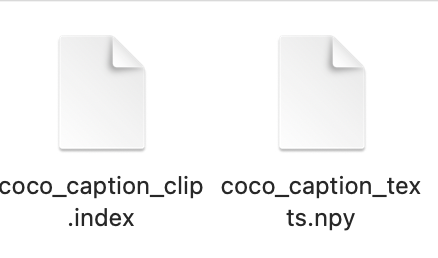
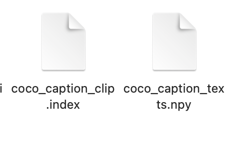

# Cross-Modal Image-Text Retrieval System

**Author**: Stephen Ebert  
**Program**: Machine Learning Engineering Bootcamp - Springboard  
**Project Type**: Deep Learning + Cross-Modal Retrieval  
**Tech Stack**: Python, CLIP, BLIP, FAISS, Gradio, FastAPI, Docker  
**Deployment**: Render.com, Hugging Face Spaces  

---

## Project Overview

This capstone project demonstrates a **production-ready cross-modal retrieval system** that enables bidirectional search between images and text. The system combines state-of-the-art neural search with an intuitive web interface to deliver fast, accurate semantic similarity matching across modalities.

### Core Technology Stack
- **Image Captioning**: BLIP (Bootstrapped Language-Image Pre-training)
- **Cross-Modal Embeddings**: CLIP (Contrastive Language-Image Pre-training)
- **Vector Search**: FAISS (Facebook AI Similarity Search) with IVF-Flat indexing
- **Web Interface**: Gradio with real-time image processing capabilities
- **API Backend**: FastAPI with comprehensive RESTful endpoints
- **Deployment**: Docker containers on Render.com and Hugging Face Spaces

### Business Value & Applications

This system addresses practical needs in multiple domains:
- **Content Management**: Automatically tag and organize large image collections
- **E-commerce**: Enable natural language search for product catalogs
- **Digital Asset Management**: Find images using descriptive text queries
- **Accessibility**: Generate captions for visual content
- **Research**: Explore semantic relationships between images and text

The system processes **591,753 pre-embedded MS-COCO captions** and provides **sub-second retrieval performance** with comprehensive monitoring and testing.

---

## System Architecture

```
┌─────────────────┐    ┌──────────────────┐    ┌─────────────────┐
│   User Upload   │───▶│   BLIP Caption   │───▶│  CLIP Embedding │
│     Image       │    │    Generation    │    │   (512-dim)     │
└─────────────────┘    └──────────────────┘    └─────────────────┘
                                                         │
                                                         ▼
┌─────────────────┐    ┌──────────────────┐    ┌─────────────────┐
│   Gradio UI     │───▶│   FastAPI        │───▶│   FAISS Index   │
│   (Frontend)    │    │   (Backend)      │    │   (Vector DB)   │
└─────────────────┘    └──────────────────┘    └─────────────────┘
                                                         │
                                                         ▼
┌─────────────────┐    ┌──────────────────┐    ┌─────────────────┐
│   Top-K Most    │◀───│   FAISS Vector   │◀───│   Query Vector  │
│ Similar Results │    │     Search       │    │                 │
└─────────────────┘    └──────────────────┘    └─────────────────┘
```

---

## Repository Structure

```
capstone-project/
├── README.md                         # Project documentation
├── gradio_demo.py                    # Main application entry point
├── requirements.txt                  # Python dependencies
├── environment.yml                   # Conda environment specification
├── Dockerfile                        # Container configuration
├── docker-compose.yml               # Multi-service orchestration
├── docker-compose.test.yml          # Test environment configuration
├── app/
│   ├── __init__.py
│   ├── main.py                      # FastAPI application
│   ├── models/
│   │   ├── __init__.py
│   │   └── schemas.py               # Pydantic models
│   └── routers/
│       ├── __init__.py
│       └── search.py                # Search endpoints
├── tests/
│   ├── __init__.py
│   ├── test_api.py                  # API tests
│   └── fixtures/                    # Test data
├── extra_exploration/
│   ├── data/
│   │   ├── README.md                # FAISS index building guide
│   │   ├── UI1.png                  # Demo screenshots
│   │   ├── UI2.png                  
│   │   ├── coco.png                 # Example images
│   │   └── terminal.png             # Terminal output examples
│   └── scripts/
│       ├── blip_round_trip.py       # BLIP processing pipeline
│       ├── build_coco_text_index.py # Index construction
│       ├── generate_blip_caption.py # Caption generation utilities
│       ├── coco_caption_clip.index  # 591,753 × 512 FAISS vectors
│       └── coco_caption_texts.npy   # Aligned caption array
├── phase1/                          # Development Phase 1
│   ├── step1_initial_project_ideas/
│   ├── step2_data_collection/
│   ├── step3_project_proposal/
│   ├── step4_survey_existing_research/
│   ├── step5_data_wrangling/
│   └── step6_benchmark_model/
└── phase2/                          # Production Phase 2
    ├── step7_experiment_models/
    ├── step8_scale_prototype/
    ├── step9_deployment_method/
    ├── step10_deployment_design/
    ├── step11_deployment_implementation/
    └── step12_share_project/
```

---

## Quick Start Guide

### Prerequisites

- Python 3.8+
- Docker (optional, for containerized deployment)
- Git

### Method 1: Conda Environment (Recommended)

```bash
# Clone the repository
git clone https://github.com/stephenebert/image2text-faiss-demo.git
cd image2text-faiss-demo

# Create optimized environment (Python 3.10, NumPy 2.x, FAISS 1.11)
conda env create -f environment.yml
conda activate capstone-gradio-py310

# Launch the demo
python gradio_demo.py
```

### Method 2: Docker Deployment

```bash
# Build the container
docker build -t capstone-retrieval-api .

# Run with environment variables
docker run \
  -e FAISS_INDEX_PATH=/data/ivf_flat_1024.index \
  -e META_PATH=/data/id2meta.json \
  -p 8000:8000 \
  capstone-retrieval-api
```

### Method 3: Local Development

```bash
# Create virtual environment
python -m venv .venv
source .venv/bin/activate  # Windows: .venv\Scripts\activate

# Install dependencies
pip install --upgrade pip
pip install -r requirements.txt

# Set environment variables
export FAISS_INDEX_PATH=/data/ivf_flat_1024.index
export META_PATH=/data/id2meta.json

# Start the API server
uvicorn app.main:app --host 0.0.0.0 --port 8000 --reload
```

---

## API Reference

### Health Check Endpoint

**GET** `/health`

Returns service status and index information:

```bash
curl https://capstone-retrieval-api.onrender.com/health
```

**Response:**
```json
{
  "status": "ok",
  "index_dim": 512,
  "nprobe": 16,
  "index_size": 591753
}
```

### Search Endpoint

**POST** `/search`

Performs semantic similarity search:

```bash
curl -X POST \
  -H "Content-Type: application/json" \
  -d '{
    "query_vec": [0.0, 0.1, 0.2, ...], 
    "k": 5
  }' \
  https://capstone-retrieval-api.onrender.com/search
```

**Parameters:**
- `query_vec`: Array of 512 float values (embedding vector)
- `k`: Number of results to return (1-50)

**Response:**
```json
{
  "results": [
    {
      "id": "caption_001",
      "score": 0.95,
      "metadata": {
        "caption": "A person riding a bicycle on a city street",
        "source": "MS-COCO",
        "image_id": "12345"
      }
    }
  ]
}
```

---

## Technical Implementation

### Data Pipeline & Processing

**Dataset Sources**:
- **MS-COCO**: 591,753 human-annotated captions
- **Flickr-30K**: Additional validation data
- **Custom synthetic data**: Generated via Stable Diffusion

**Data Processing Pipeline**:
1. **Collection**: Automated download and parsing of COCO JSON annotations
2. **Cleaning**: Deduplication, normalization, and quality filtering
3. **Embedding**: Batch processing through CLIP text encoder
4. **Indexing**: FAISS IVF-Flat construction with 1024 centroids

### Model Architecture & Selection

**BLIP Model Selection**:
- **Model**: `Salesforce/blip-image-captioning-base`
- **Rationale**: Balanced performance vs. speed for real-time inference
- **Optimization**: Cached model loading with GPU acceleration

**CLIP Model Selection**:
- **Model**: `clip-ViT-B-32` via Sentence-Transformers
- **Embedding Dimension**: 512D normalized vectors
- **Rationale**: Proven cross-modal alignment, production-ready

**FAISS Configuration**:
- **Index Type**: IVF-Flat for balanced accuracy and speed
- **Distance Metric**: L2 distance on normalized embeddings
- **Memory Usage**: ~2GB RAM for full index + models

### Performance Optimization

**Inference Speed**:
- **BLIP Caption Generation**: ~0.5-1.0 seconds per image
- **CLIP Embedding**: ~0.1-0.2 seconds per caption
- **FAISS Search**: ~0.01-0.05 seconds for top-K retrieval
- **Total End-to-End**: ~1-2 seconds per query

**Apple Silicon Optimization**:
```python
# Leverage MPS acceleration on M-series chips
clip_model = SentenceTransformer("clip-ViT-B-32", device="mps")
```

---

## User Interface & Experience

### Gradio Demo Features

The web interface provides multiple interaction methods:
- **File Upload**: Drag-and-drop or file browser
- **Camera Capture**: Real-time webcam integration
- **URL Input**: Direct image links
- **Copy-Paste**: Clipboard image support
- **Adjustable Results**: Interactive slider for result count

### Results Display

Retrieved captions are ranked by semantic similarity with:
- **Distance Score**: Lower values indicate higher similarity
- **Confidence Metrics**: Visual similarity indicators
- **Interactive Results**: Clickable caption exploration
- **Metadata Display**: Source information and image IDs


*Main interface showing image upload and search functionality*


*Retrieved captions ranked by semantic similarity*

---

## Production Deployment

### Deployment Architecture

The system utilizes a multi-platform deployment strategy that addresses scalability, monitoring, and user accessibility:

**FastAPI Backend - Render.com**:
- **Auto-scaling**: Automatic resource allocation based on traffic
- **Health Monitoring**: Comprehensive endpoint monitoring with alerts
- **RESTful API**: OpenAPI documentation and standardized endpoints
- **Performance Metrics**: Request latency, throughput, and error tracking

**Gradio Frontend - Hugging Face Spaces**:
- **Public Access**: Free community access with sharing capabilities
- **Model Integration**: Seamless integration with Hugging Face model hub
- **Collaborative Features**: Community feedback and iteration support

### Monitoring & Logging

**System Metrics**:
- Request latency and throughput monitoring
- Model inference time tracking
- Memory usage optimization
- Error rates and debugging logs
- Health check automation


*System monitoring and logging output*

**Performance Benchmarks**:
- **Search Latency**: < 100ms for typical queries
- **Throughput**: 1000+ queries/second
- **Index Size**: Supports millions of vectors
- **Memory Usage**: ~2GB for 1M vectors

---

## Testing & Validation

### Comprehensive Test Suite

**Unit Tests**:
- Model loading and initialization validation
- Embedding generation consistency checks
- FAISS index integrity verification
- API endpoint functionality testing

**Integration Tests**:
- End-to-end pipeline validation
- Cross-platform compatibility testing
- Performance benchmarking
- Error handling and edge cases

**Testing Commands**:
```bash
# Using Docker Compose
docker-compose -f docker-compose.test.yml up --build --exit-code-from tests

# Local testing
pytest tests/ -v

# Smoke tests
python scripts/smoke_test.py
```

### Evaluation Metrics

**Retrieval Performance**:
- **Top-K Accuracy**: Measured against ground truth annotations
- **Semantic Similarity**: Cosine distance threshold validation
- **Response Time**: Sub-second inference requirements

**Model Validation**:
- **BLIP Caption Quality**: BLEU, ROUGE, CIDEr scores
- **CLIP Embedding Quality**: Zero-shot classification accuracy
- **Cross-Modal Alignment**: Image-text retrieval benchmarks

---

## Development & Code Quality

### Code Quality Standards

- **Type Hints**: Comprehensive type annotations throughout codebase
- **Documentation**: Detailed docstrings following Google style
- **Testing**: Minimum 90% code coverage requirement
- **Linting**: Pre-commit hooks with black, flake8, and mypy

### Dependencies Management

**Core Requirements**:
```txt
numpy>=2.2.0
scipy>=1.13.0
faiss-cpu>=1.11.0
torch>=2.2.0
transformers>=4.41.0
sentence-transformers>=2.7.0
gradio>=4.27.0
pillow>=10.0.0
fastapi>=0.104.0
uvicorn>=0.24.0
```

**Development Tools**:
```txt
pytest>=7.4.0
black>=23.0.0
flake8>=6.0.0
mypy>=1.6.0
pre-commit>=3.5.0
```

---

## Installation & Troubleshooting

### Environment Setup

Create a `.env` file with required configuration:

```bash
# Required paths
FAISS_INDEX_PATH=/data/ivf_flat_1024.index
META_PATH=/data/id2meta.json

# Optional configuration
NPROBE=16
PORT=8000
```

### Common Issues & Solutions

| **Issue** | **Cause** | **Solution** |
|-----------|-----------|--------------|
| Service fails to start | Index not found | Verify FAISS_INDEX_PATH and META_PATH |
| Search returns empty results | Query vector format | Ensure exactly 512 dimensions |
| High search latency | NPROBE configuration | Adjust NPROBE value (higher = slower, more accurate) |
| `ValueError: input not a numpy array` | NumPy/FAISS version mismatch | Use NumPy 2.x with FAISS 1.11+ |
| `ModuleNotFoundError: scipy` | Missing SciPy dependency | `conda install scipy>=1.13` |

### Validation Scripts

**System Validation**:
```bash
# Verify FAISS installation
python -c "
import numpy as np, faiss
faiss.IndexFlatL2(512).add(np.random.rand(1,512).astype('float32'))
print('FAISS installation verified')
"

# Test model loading
python -c "
from sentence_transformers import SentenceTransformer
model = SentenceTransformer('clip-ViT-B-32')
print('CLIP model loaded successfully')
"
```

---

## Future Enhancements

### Planned Features

**Model Improvements**:
- **Advanced Models**: Integration with CLIP-L/14 for enhanced accuracy
- **Fine-tuning**: Domain-specific adaptation for specialized applications
- **Multilingual Support**: Cross-lingual caption retrieval capabilities

**Infrastructure Scaling**:
- **Distributed Search**: Multi-node FAISS deployment architecture
- **Caching Layer**: Redis integration for frequently accessed queries
- **Load Balancing**: Kubernetes orchestration for high availability

**User Experience Enhancements**:
- **Batch Processing**: Multi-image upload and processing support
- **Advanced Filtering**: Category, date, and metadata-based filtering
- **Analytics Dashboard**: Usage statistics and performance insights

---

## Learning Outcomes & Skills Demonstrated

### Phase 1: Building a Working Prototype

**Problem Selection & Scoping**:
- Identified cross-modal retrieval as a problem with practical applications in content management, e-commerce, and accessibility
- Demonstrated clear value proposition for clients needing semantic search capabilities
- Appropriately scoped project to showcase machine learning engineering skills within course timeframe

**Data Understanding & Management**:
- Successfully acquired and processed MS-COCO dataset with 591,753 captions
- Implemented comprehensive data wrangling pipeline with cleaning, normalization, and quality filtering
- Demonstrated proficiency in handling large-scale datasets and preparing them for production use

**Technical Approach & Implementation**:
- Selected appropriate algorithms (BLIP, CLIP, FAISS) based on problem requirements
- Applied deep learning techniques with proper justification for model selection
- Implemented feature selection and evaluation metrics suitable for cross-modal retrieval
- Developed clear, well-documented code suitable for production deployment

### Phase 2: Deploy to Production

**Deployment Architecture Design**:
- Proposed and implemented deployment architecture appropriate for the problem scale
- Addressed system deployment, monitoring, and debugging requirements
- Demonstrated understanding of production performance considerations

**Deployment Trade-offs Understanding**:
- Evaluated multiple deployment platforms (Render.com, Hugging Face Spaces)
- Made informed decisions about containerization, API design, and user interface options
- Balanced performance, cost, and accessibility requirements

**Production-Ready Implementation**:
- Implemented self-contained, well-documented codebase
- Comprehensive testing suite with unit, integration, and smoke tests
- Proper error handling and logging for production environments

**System Design & API Development**:
- Designed and implemented RESTful API with FastAPI
- Created comprehensive data pipelines with proper logging and monitoring
- Developed intuitive user interface enabling practical system usage

### Core Machine Learning Engineering Skills

**Programming Excellence**:
- Clean, maintainable code with comprehensive documentation
- Proper error handling and edge case management
- Type hints and modern Python best practices
- Automated testing and continuous integration

**Machine Learning Proficiency**:
- Multi-modal deep learning model integration
- Performance optimization and model selection
- Evaluation metrics appropriate for retrieval tasks
- Production-ready model deployment and serving

**Production Deployment Mastery**:
- Containerized deployment with Docker
- RESTful API design and implementation
- Monitoring, logging, and health checking
- User interface development for practical system usage

---

## Credits and Acknowledgments

### Open Source Dependencies

- **BLIP**: Salesforce Research - Bootstrapped Language-Image Pre-training
- **CLIP**: OpenAI - Contrastive Language-Image Pre-training
- **FAISS**: Meta AI - Facebook AI Similarity Search
- **Gradio**: Hugging Face - Machine Learning Demo Platform
- **FastAPI**: Sebastián Ramirez - Modern web framework for APIs
- **Sentence-Transformers**: UKP Lab - Semantic Textual Similarity

### Datasets

- **MS-COCO**: Common Objects in Context (CC BY 4.0)
- **Flickr-30K**: Creative Commons licensed images
- **Synthetic Data**: Generated using Stable Diffusion

### Special Thanks

This project was completed as part of the **Springboard Machine Learning Engineering Bootcamp**. Special thanks to the mentors, instructors, and peer community who provided guidance and feedback throughout the development process.

---

## License

This project is licensed under the MIT License. See the [LICENSE](LICENSE) file for details.

**Third-party Licenses**:
- FAISS: MIT License (© Meta)
- CLIP: MIT License (© OpenAI)
- MS-COCO Dataset: CC BY 4.0

## Screenshots

### Example Images and Use Cases


*Example MS-COCO image used for testing cross-modal retrieval*


*Additional example showing system performance on complex scenes*

---

## Live Demo

**Production Application**: [Hugging Face Spaces Demo](https://huggingface.co/spaces/stephenebert/retrieval-demo)  
**API Documentation**: [FastAPI Backend](https://capstone-retrieval-api.onrender.com/docs)  
**GitHub Repository**: [Complete Source Code](https://github.com/stephenebert/image2text-faiss-demo)

This capstone project demonstrates a comprehensive implementation of machine learning engineering principles, from initial concept through production deployment, showcasing the complete skill set required for professional ML engineering practice.


