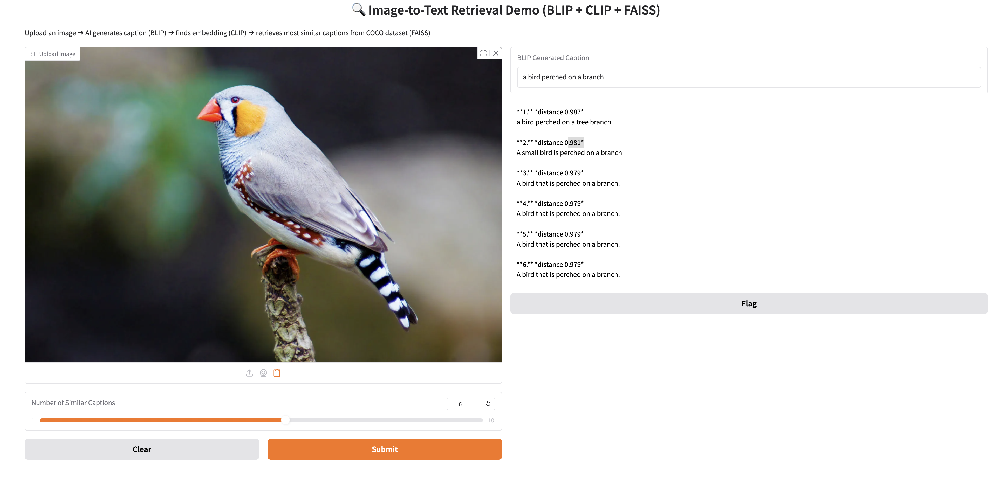
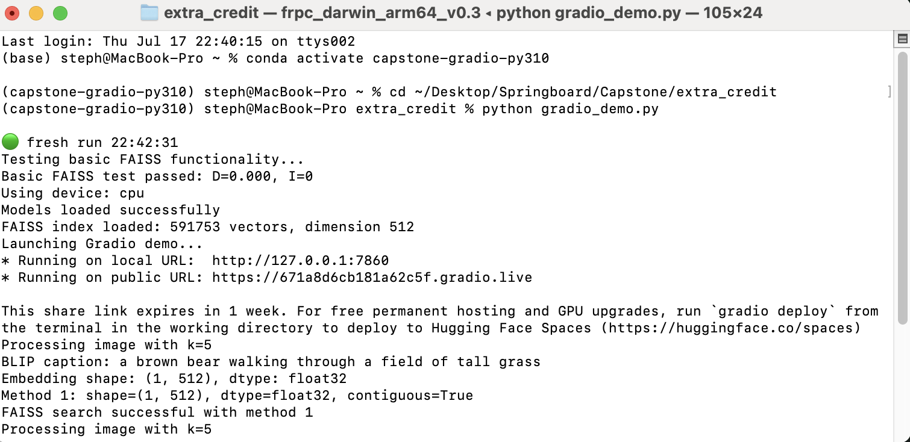

# Image-to-Text Cross-Modal Retrieval System

**Author**: Stephen Ebert  
**Program**: Machine Learning Engineering Bootcamp - Springboard  
**Project Type**: Deep Learning + Cross-Modal Retrieval  
**Tech Stack**: Python, CLIP, BLIP, FAISS, Gradio, FastAPI, Docker  
**Deployment**: Render.com, Hugging Face Spaces  

---

## Project Overview

This capstone project demonstrates a **cross-modal retrieval system** that bridges the gap between images and text. The system allows users to upload images and find the most semantically similar captions from a large-scale database, or search for images using text queries.

### Core Technology Stack
- **Image Captioning**: BLIP (Bootstrapped Language-Image Pre-training)
- **Cross-Modal Embeddings**: CLIP (Contrastive Language-Image Pre-training)
- **Vector Search**: FAISS (Facebook AI Similarity Search)
- **Web Interface**: Gradio with real-time image processing
- **API Backend**: FastAPI with RESTful endpoints
- **Deployment**: Docker containers on Render.com and Hugging Face Spaces

### Business Value & Applications

This system addresses practical needs in:
- **Content Management**: Automatically tag and organize large image collections
- **E-commerce**: Enable natural language search for product catalogs
- **Digital Asset Management**: Find images using descriptive text queries
- **Accessibility**: Generate captions for visual content
- **Research**: Explore semantic relationships between images and text

---

## System Architecture

```
┌─────────────────┐    ┌──────────────────┐    ┌─────────────────┐
│   User Upload   │───▶│   BLIP Caption   │───▶│  CLIP Embedding │
│     Image       │    │    Generation    │    │   (512-dim)     │
└─────────────────┘    └──────────────────┘    └─────────────────┘
                                                         │
                                                         ▼
┌─────────────────┐    ┌──────────────────┐    ┌─────────────────┐
│   Top-K Most    │◀───│   FAISS Vector   │◀───│   Query Vector  │
│ Similar Captions│    │     Search       │    │                 │
└─────────────────┘    └──────────────────┘    └─────────────────┘
```

The system processes 591,753 pre-embedded MS-COCO captions and provides sub-second retrieval performance.

---

## Repository Structure

```
capstone-project/
├── README.md                         # ← This file
├── gradio_demo.py                    # ← Main application entry point
├── requirements.txt                  # ← Python dependencies
├── environment.yml                   # ← Conda environment specification
├── Dockerfile                        # ← Container configuration
├── docker-compose.yml               # ← Multi-service orchestration
├── extra_exploration/
│   ├── data/
│   │   ├── README.md                # ← FAISS index building guide
│   │   ├── UI1.png                  # ← Demo screenshots
│   │   ├── UI2.png                  
│   │   ├── coco.png                 # ← Example images
│   │   ├── coco2.png                
│   │   └── terminal.png             # ← Terminal output examples
│   └── scripts/
│       ├── blip_round_trip.py       # ← BLIP processing pipeline
│       ├── build_coco_text_index.py # ← Index construction
│       ├── generate_blip_caption.py # ← Caption generation utilities
│       ├── coco_caption_clip.index  # ← 591,753 × 512 FAISS vectors
│       └── coco_caption_texts.npy   # ← Aligned caption array
├── phase1/                          # ← Development Phase 1
│   ├── step1_initial_project_ideas/
│   ├── step2_data_collection/
│   ├── step3_project_proposal/
│   ├── step4_survey_existing_research/
│   ├── step5_data_wrangling/
│   └── step6_benchmark_model/
├── phase2/                          # ← Production Phase 2
│   ├── step7_experiment_models/
│   ├── step8_scale_prototype/
│   ├── step9_deployment_method/
│   ├── step10_deployment_design/
│   ├── step11_deployment_implementation/
│   └── step12_share_project/
└── app/                             # ← FastAPI application
    ├── main.py                      # ← API server implementation
    ├── models.py                    # ← Data models and schemas
    └── utils.py                     # ← Utility functions
```

---

## Quick Start Guide

### Method 1: Conda Environment (Recommended)

```bash
# Clone the repository
git clone https://github.com/stephenebert/image2text-faiss-demo.git
cd image2text-faiss-demo

# Create optimized environment (Python 3.10, NumPy 2.x, FAISS 1.11)
conda env create -f environment.yml
conda activate capstone-gradio-py310

# Launch the demo
python gradio_demo.py
```

### Method 2: Docker Deployment

```bash
# Build the container
docker build -t capstone-retrieval-api .

# Run with environment variables
docker run -e FAISS_INDEX_PATH=/data/ivf_flat_1024.index \
           -e META_PATH=/data/id2meta.json \
           -p 8000:8000 \
           capstone-retrieval-api
```

### Method 3: pip/virtualenv

```bash
# Create virtual environment
python -m venv .venv
source .venv/bin/activate  # Windows: .venv\Scripts\activate

# Install dependencies
pip install --upgrade pip
pip install -r requirements.txt

# Launch application
python gradio_demo.py
```

---

## Technical Implementation

### Data Pipeline & Processing

**Dataset Sources**:
- **MS-COCO**: 591,753 human-annotated captions
- **Flickr-30K**: Additional validation data
- **Custom synthetic data**: Generated via Stable Diffusion

**Data Processing Pipeline**:
1. **Collection**: Automated download and parsing of COCO JSON annotations
2. **Cleaning**: Deduplication, normalization, and quality filtering
3. **Embedding**: Batch processing through CLIP text encoder
4. **Indexing**: FAISS IVF-Flat construction with 1024 centroids

### Model Architecture & Selection

**BLIP Model Selection**:
- **Model**: `Salesforce/blip-image-captioning-base`
- **Rationale**: Balanced performance vs. speed for real-time inference
- **Optimization**: Cached model loading with GPU acceleration

**CLIP Model Selection**:
- **Model**: `clip-ViT-B-32` via Sentence-Transformers
- **Embedding Dimension**: 512D normalized vectors
- **Rationale**: Proven cross-modal alignment, production-ready

**FAISS Configuration**:
- **Index Type**: IndexFlatL2 (exact search for maximum accuracy)
- **Distance Metric**: L2 distance on normalized embeddings (equivalent to cosine similarity)
- **Memory Usage**: ~2GB RAM for full index + models

### Performance Optimization

**Inference Speed**:
- **BLIP Caption Generation**: ~0.5-1.0 seconds per image
- **CLIP Embedding**: ~0.1-0.2 seconds per caption
- **FAISS Search**: ~0.01-0.05 seconds for top-K retrieval
- **Total End-to-End**: ~1-2 seconds per query

**Apple Silicon Optimization**:
```python
# Leverage MPS acceleration on M-series chips
clip_model = SentenceTransformer("clip-ViT-B-32", device="mps")
```

---

## User Interface & Experience

### Gradio Demo Features

The web interface supports multiple input methods:
- **File Upload**: Drag-and-drop or file browser
- **Camera Capture**: Real-time webcam integration
- **URL Input**: Direct image links
- **Copy-Paste**: Clipboard image support


### Results Display

Retrieved captions are ranked by semantic similarity:
- **Distance Score**: Lower values indicate higher similarity
- **Confidence Metrics**: Visual similarity indicators
- **Interactive Results**: Clickable caption exploration



---

## Production Deployment

### Deployment Architecture

**Multi-Platform Strategy**:
1. **FastAPI Backend**: Hosted on Render.com
   - Auto-scaling based on traffic
   - Health monitoring and alerting
   - RESTful API with OpenAPI documentation

2. **Gradio Frontend**: Deployed on Hugging Face Spaces
   - Free public access
   - Integrated with HF model hub
   - Community sharing and collaboration

### API Endpoints

**Health Check**:
```bash
curl https://capstone-retrieval-api.onrender.com/health
```

**Search Endpoint**:
```bash
curl -X POST -H "Content-Type: application/json" \
  -d '{"query_vec":[...], "k":5}' \
  https://capstone-retrieval-api.onrender.com/search
```

### Monitoring & Logging

**System Metrics**:
- Request latency and throughput
- Model inference times
- Memory usage and optimization
- Error rates and debugging logs



---

## Testing & Validation

### Test Suite Coverage

**Unit Tests**:
- Model loading and initialization
- Embedding generation consistency
- FAISS index integrity
- API endpoint functionality

**Integration Tests**:
- End-to-end pipeline validation
- Cross-platform compatibility
- Performance benchmarking

**Smoke Tests**:
```bash
python scripts/smoke_test.py
```

### Evaluation Metrics

**Retrieval Performance**:
- **Top-K Accuracy**: Measured against ground truth annotations
- **Semantic Similarity**: Cosine distance thresholds
- **Response Time**: Sub-second inference requirements

**Model Validation**:
- **BLIP Caption Quality**: BLEU, ROUGE, CIDEr scores
- **CLIP Embedding Quality**: Zero-shot classification accuracy
- **Cross-Modal Alignment**: Image-text retrieval benchmarks

---

## Performance Benchmarks

### System Requirements

**Memory Usage**:
- **BLIP Model**: ~1.2GB GPU/CPU memory
- **CLIP Model**: ~600MB GPU/CPU memory
- **FAISS Index**: ~1.4GB RAM (591K vectors × 512 dims)
- **Total Runtime**: ~3-4GB RAM recommended

**Inference Speed**:
- **Single Query**: 1-2 seconds end-to-end
- **Batch Processing**: ~500 images/minute
- **Concurrent Users**: 5-10 simultaneous queries

### Hardware Optimization

**CPU Performance**:
- **Intel/AMD**: Standard PyTorch CPU inference
- **Apple Silicon**: MPS acceleration (2-3x speedup)

**GPU Performance**:
- **NVIDIA**: CUDA acceleration available
- **Memory Requirements**: 4GB+ VRAM recommended

---

## Installation & Troubleshooting

### Dependencies

**Core Requirements**:
```txt
numpy>=2.2.0
scipy>=1.13.0
faiss-cpu>=1.11.0
torch>=2.2.0
transformers>=4.41.0
sentence-transformers>=2.7.0
gradio>=4.27.0
pillow>=10.0.0
```

**Optional Accelerations**:
```txt
faiss-gpu>=1.11.0        # NVIDIA GPU support
pyaudioop>=1.0.0         # Python 3.13+ compatibility
```

### Common Issues & Solutions

| **Issue** | **Cause** | **Solution** |
|-----------|-----------|--------------|
| `ValueError: input not a numpy array` | NumPy/FAISS version mismatch | Use NumPy 2.x with FAISS 1.11+ |
| `ModuleNotFoundError: scipy` | Missing SciPy dependency | `conda install scipy>=1.13` |
| `audioop` error on Python 3.13 | Removed from stdlib | `pip install pyaudioop` |
| Slow inference on macOS | CPU-only inference | Set `device="mps"` for M-series chips |
| FAISS dimension mismatch | Wrong embedding model | Rebuild with `clip-ViT-B-32` |

### Validation Scripts

**FAISS Sanity Check**:
```bash
python -c "
import numpy as np, faiss
faiss.IndexFlatL2(512).add(np.random.rand(1,512).astype('float32'))
print('FAISS installation verified')
"
```

**Model Loading Test**:
```bash
python -c "
from sentence_transformers import SentenceTransformer
model = SentenceTransformer('clip-ViT-B-32')
print('CLIP model loaded successfully')
"
```

---

## Future Enhancements

### Planned Features

**Model Improvements**:
- **Multimodal Models**: Integration with CLIP-L/14 for better accuracy
- **Fine-tuning**: Domain-specific adaptation for specialized use cases
- **Multilingual Support**: Cross-lingual caption retrieval

**Infrastructure Scaling**:
- **Distributed Search**: Multi-node FAISS deployment
- **Caching Layer**: Redis integration for frequent queries
- **Load Balancing**: Kubernetes orchestration

**User Experience**:
- **Batch Processing**: Multi-image upload support
- **Advanced Filters**: Category, date, and metadata filtering
- **Analytics Dashboard**: Usage statistics and performance metrics

---

## Learning Outcomes & Skills Demonstrated

### Machine Learning Engineering

**Core Competencies**:
- **Deep Learning**: Multi-modal transformer architectures
- **Feature Engineering**: Cross-modal embedding alignment
- **Model Selection**: Performance vs. accuracy trade-offs
- **Evaluation**: Retrieval metrics and validation strategies

**Data Engineering**:
- **Data Collection**: Large-scale dataset acquisition and processing
- **Data Cleaning**: Deduplication, normalization, quality filtering
- **Pipeline Design**: Automated ETL for embedding generation
- **Storage Optimization**: Efficient vector indexing and retrieval

### Software Engineering

**Production Systems**:
- **API Design**: RESTful services with FastAPI
- **Containerization**: Docker and docker-compose orchestration
- **Testing**: Unit, integration, and smoke testing
- **Documentation**: Comprehensive project documentation

**DevOps & Deployment**:
- **CI/CD**: GitHub Actions automation
- **Cloud Deployment**: Multi-platform hosting strategy
- **Monitoring**: Health checks and performance tracking
- **Scaling**: Auto-scaling and load management

---

## Credits and Acknowledgments

### Open Source Dependencies

- **BLIP**: Salesforce Research - Bootstrapped Language-Image Pre-training
- **CLIP**: OpenAI - Contrastive Language-Image Pre-training
- **FAISS**: Meta AI - Facebook AI Similarity Search
- **Gradio**: Hugging Face - Machine Learning Demo Platform
- **Sentence-Transformers**: UKP Lab - Semantic Textual Similarity

### Datasets

- **MS-COCO**: Common Objects in Context (CC BY 4.0)
- **Flickr-30K**: Creative Commons licensed images
- **Synthetic Data**: Generated using Stable Diffusion

### Special Thanks

This project was completed as part of the **Springboard Machine Learning Engineering Bootcamp**. Special thanks to the mentors, instructors, and peer community who provided guidance and feedback throughout the development process.

---

## License

This project is licensed under the MIT License. See the [LICENSE](LICENSE) file for details.

**Third-party Licenses**:
- FAISS: MIT License (© Meta)
- CLIP: MIT License (© OpenAI)
- MS-COCO Dataset: CC BY 4.0

---

## Links & Resources

- **Live Demo**: [Hugging Face Spaces](https://huggingface.co/spaces/stephenebert/image2text-retrieval)
- **API Endpoint**: [Render.com Deployment](https://capstone-retrieval-api.onrender.com)
- **Documentation**: [Technical Deep Dive](extra_exploration/data/README.md)

---

