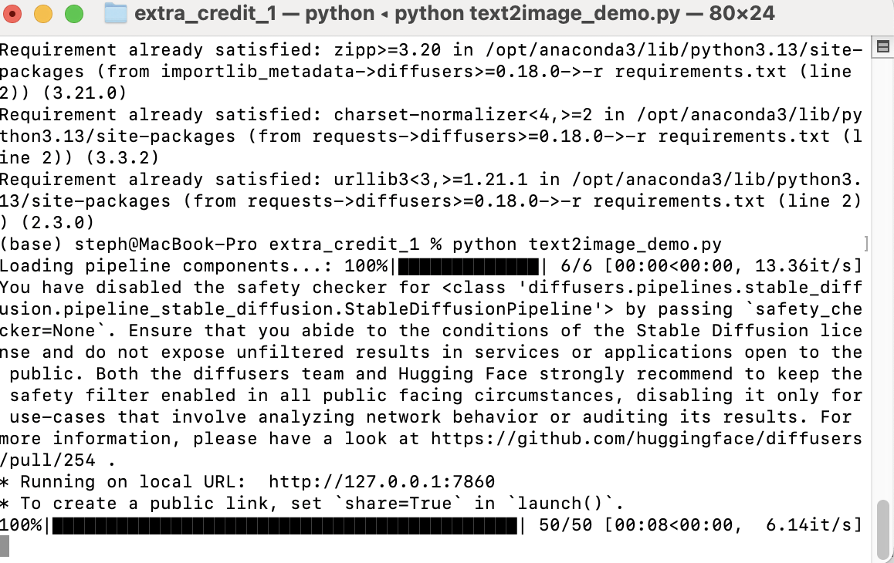

# Stable Diffusion v1.5 — Text → Image Demo

[](https://huggingface.co/spaces/stephenebert/sd-text2image)

Turn any prompt into a 512 × 512 image using **Stable Diffusion v1.5** (🤗 **diffusers**) wrapped in a clean **Gradio** UI.  
Runs on CPU, CUDA, **or Apple Silicon (M-series Metal)**.


---
## Overview
1. One-file Gradio app (```text2image_demo.py```)
   - Detects your compute backend (CUDA, Apple Metal / MPS, or CPU).
   - Pulls Stable Diffusion v1.5 from the Hugging Face Hub the first time you run it (cached afterwards).
3. Minimal UI
   Delivered with Gradio:

| Control                    | Purpose                                                                          |
| -------------------------- | -------------------------------------------------------------------------------- |
| **Prompt** textbox         | The text you want to turn into an image.                                         |
| **Inference Steps** slider | How many denoising steps to run (≈ quality vs. speed).                           |
| **Guidance Scale** slider  | “CFG” scale—how strongly the model follows your prompt.                          |
| **Seed** field             | `0` or blank → random; any other int means *re-generate exactly the same image*. |

A two-column Gallery on the right shows each image as soon as it’s finished and lets you download it.


3. Under the hood: the SD pipeline
```
Text Prompt ──▶ CLIP Text Encoder ──▶ Text Embedding
                                            │
                                            ▼
                                      Scheduler (DDIM) ──▶ Iterative Denoising
                                            │                in Latent Space
                                            ▼                      │
                                      Random Noise ──▶ UNet ◀──────┘
                                            │         (guided by text embedding)
                                            ▼
                                      Final Latent ──▶ VAE Decoder ──▶ 512×512 RGB Image
```
- Inference Steps = number of DDIM iterations.
- Guidance Scale mixes the unconditional and conditional UNet predictions (higher = stricter prompt following).
- The seed is fed to the scheduler’s RNG; same seed + prompt + params = identical image.

4. Zero bulky repo assets
No checkpoints inside the repo—only ~50 lines of Python plus a few screenshots.
Requirements are light (< 300 MB once the SD weights are cached).

5. Cross-platform

- CUDA: full FP16 SD inference.
- Apple Silicon: Metal acceleration automatically triggered (```torch.backends.mps```)
- CPU: still works; just slower.

6. Directory
```
extra_exploration_1/
├─ images/                  # screenshots for the README
├─ text2image_demo.py       # the Gradio app
├─ requirements.txt         # 6 core deps (torch, diffusers …)
├─ pyaudioop.py             # shim so Gradio ≥4.28 installs cleanly on Python 3.13
└─ README.md                # quick-start, examples, feature table
```
End-to-end flow

1. ```pip install -r requirements.txt```
2. ```python text2image_demo.py```
3. Browser opens → type prompt → click Generate → watch the latent noise resolve into an image (progress bar & live updates).

You can run this locally or package into a Hugging Face Space.

---

## Features

| Ready  | What                                                  |
|:--------:|-------------------------------------------------------|
| ✔️       | Prompt textbox + sliders (steps, CFG scale)            |
| ✔️       | Optional deterministic seed                           |
| ✔️       | Two-column **Gallery** with download buttons          |
| ✔️       | Auto-detects GPU (CUDA or MPS)                        |
| ✔️       | Zero bulky assets – model is pulled & cached automatically |

> **Speed tip & cold-start notice**  
> This Space is hosted on the free **CPU-basic** tier (2 vCPU / 16 GB RAM).  
> The very first prompt after a restart has to download the 4 GB SD v1.5 weights **and** warm up the UNet/VAE – expect ~60 s before the first image appears.  
> Subsequent prompts on the same session are much faster (≈20 s @ 512²).  
> Running locally on an Apple-silicon Mac (`--device mps`, fp16) cuts that to **12-20 s**, and on a mid-range CUDA GPU to **4-8 s**.  
> If you need instant answers in the hosted Space, switch to a paid GPU (e.g. **Nvidia T4 small, \$0.40 /hr**) and pause the hardware when you’re done.

---

## Quick Start

```bash
git clone https://github.com/<your-handle>/stable-diffusion-t2i-demo.git
cd stable-diffusion-t2i-demo

python -m venv .venv && source .venv/bin/activate   # Win: .venv\Scripts\activate
pip install -r requirements.txt

python text2image_demo.py          # http://127.0.0.1:7860
```
For M-chip users:

``` bash
# Apple-silicon users – optional but recommended
pip install --pre torch torchvision torchaudio --index-url https://download.pytorch.org/whl/nightly/cpu
```


---

## requirements.txt
```
torch>=2.2
diffusers>=0.28
transformers>=4.42
accelerate>=0.29
safetensors
gradio>=4.28
pyaudioop ; python_version >= "3.13"   # optional shim for Gradio’s audio import
```

## Acknowledgements
- Stable Diffusion v1.5: CompVis, Runway, Stability AI, LAION
- diffusers, transformers, gradio: Hugging Face
