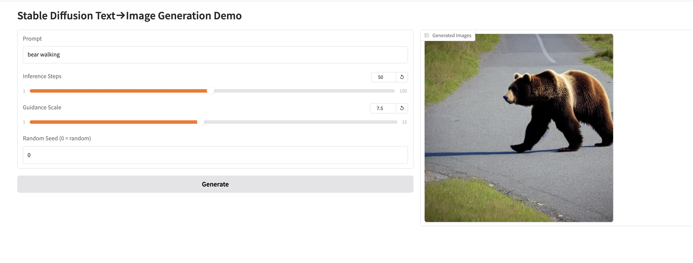

# ✨ Stable Diffusion v1.5 — Text → Image Demo

[](https://huggingface.co/spaces/<YOUR-HF-HANDLE>/sd15-t2i-demo)

Turn any prompt into a 512 × 512 image using **Stable Diffusion v1.5** (🤗 **diffusers**) wrapped in a clean **Gradio** UI.  
Runs on CPU, CUDA, **or Apple Silicon (M-series Metal)**.



---

## Features

| Ready  | What                                                  |
|:--------:|-------------------------------------------------------|
| ✔️       | Prompt textbox + sliders (steps, CFG scale)            |
| ✔️       | Optional deterministic seed                           |
| ✔️       | Two-column **Gallery** with download buttons          |
| ✔️       | Auto-detects GPU (CUDA or MPS)                        |
| ✔️       | Zero bulky assets – model is pulled & cached automatically |

---

## Quick Start

```bash
git clone https://github.com/<your-handle>/stable-diffusion-t2i-demo.git
cd stable-diffusion-t2i-demo

python -m venv .venv && source .venv/bin/activate   # Win: .venv\Scripts\activate
pip install -r requirements.txt

python text2image_demo.py          # http://127.0.0.1:7860
```

---

## requirements.txt

torch>=2.2
diffusers>=0.28
transformers>=4.42
accelerate>=0.29
safetensors
gradio>=4.28
pyaudioop ; python_version >= "3.13"   # optional shim for Gradio’s audio import

## Repo Layout

stable-diffusion-t2i-demo/
├── text2image_demo.py     # main Gradio app
├── requirements.txt
├── examples/              # sample outputs for README/Docs
│   ├── bear_walking.png
│   └── steampunk_otter.png
└── README.md             

## Performance Table

| Device           | Steps | Time   |
| ---------------- | ----- | ------ |
| **M2 Max (mps)** | 50    | \~9 s  |
| RTX 3080 10 GB   | 50    | \~4 s  |
| 8-core CPU       | 50    | \~50 s |

Measured with Torch 2.2 + Diffusers 0.28

## Acknowledgements
- Stable Diffusion v1.5 — CompVis, Runway, Stability AI, LAION
- diffusers, transformers, gradio — Hugging Face
